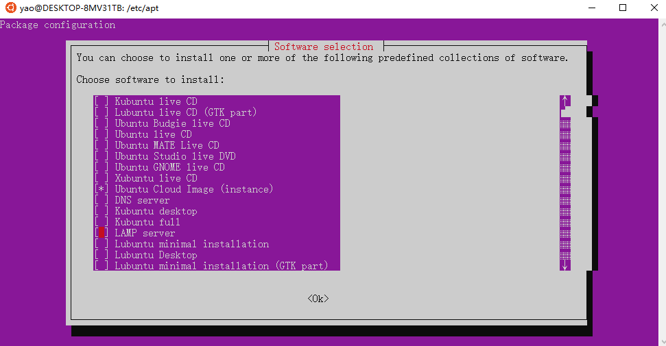
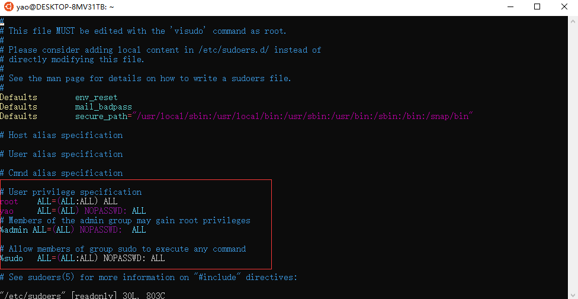
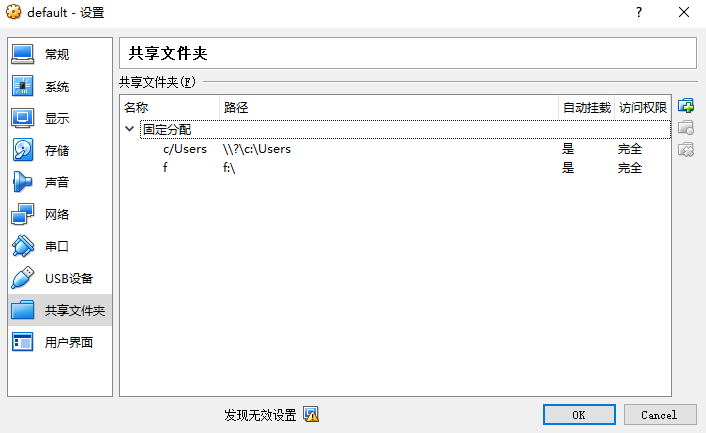
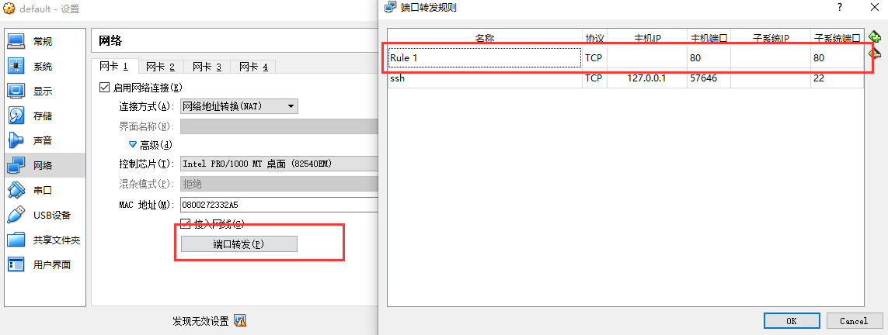

#   Windows开发环境最佳实践

刚才卸Docker把电脑卸崩了, 连不上网, 重置一下电脑, 正好记录下Windows开发环境的最佳实践.


#   必备软件
1.  OneDrive
    1.  OneDrive是微软官方云盘, 普通用户有5G容量, office365用户可以升到1T, 文件自带版本控制功能, 30天以内的不同版本都可以还原
    2.  一个很重要的功能在于, OneDrive在系统级别支持同步个人目录下的Desktop/Document/Picture, 而我们所有个人文件(软件配置/数据库/工作代码)默认都在这三个目录里, 这三个文件夹放在云上, 即使系统重置, 我们也只要重装一遍软件, 装软件时一路next, 其他啥都不用管(所有配置都在Document里(云上), 嗯哼)
    3.  常用的工具类软件都可以放在这里, 我自己的目录结构为
        ```
        OneDrive
            -   文档(对应于Document)
                -   个人文档
                    -   keepass
                        -   password.kdbx 保存的keepass密码数据库, 所有密码均记录在这里
                        -   Chinese_Simplified.lngx keepass中文语言包, 系统重装完直接往`C:/Program Files (x86)/KeePass Password Safe 2/Languages`拷一份
                            -   下载地址: https://downloads.sourceforge.net/keepass/KeePass-2.39-Chinese_Simplified.zip
                    -   Program
                        -   comder
                            -   最好用的PowerShell客户端
                            -   为了方便从comder中直接进入开发目录(F:/www), 可以给www目录在主目录下建个硬链接
                                -   New-Item -Path C:\Users\yaoze\www -ItemType SymbolicLink -Value F:\www 
                                -   当然也可以在设置里配置powershell的启动目录, 更省事
                                    -   
                        -   hosts
                            -   对应于Windows的host文件, 保存到云盘上, 这样即使切换到其他电脑也能同步过去
                            -   配置命令为(在管理员权限下的PowerShell中进行操作):
                                -   删除旧Hosts文件 
                                    -   rm C:\Windows\System32\drivers\etc\hosts
                                -   在原有位置生成云盘hosts的硬链接
                                    -   New-Item -Path C:\Windows\System32\drivers\etc\hosts -ItemType SymbolicLink -Value F:\OneDrive\Documents\个人文档\Program\hosts 
                        -   shadowsocks
                            -   科学上网
                            -   把运行程序放到云盘里, 重置机器, 装完系统, 双击运行. over  
        ```                            
2.  Chrome
    1.  浏览器
    2.  [扩展推荐](http://www.yaozeyuan.online/2018/01/08/2018/01/Chrome扩展推荐/)
    3.  [调试进阶](http://www.yaozeyuan.online/2018/05/18/2018/05/Chrome调试进阶/)
3.  迅雷
    1.  广告虽然多, 但迅雷下载还是最快的
4.  KeePass
    1.  密码管理程序
    2.  程序员会有各种各样的账号密码, 管理账号密码是个问题, 所以对应的最佳实践如下:
        1.  所有账户密码均使用keepass生成/管理, 只要记住数据文件的主密码即可
            1.  KeePass设定上每15分钟&锁屏自动锁定, 避免窥屏 
        2.  密码数据库存放到云盘上(OneDrive), 避免丢失(OneDrive有自动同步&版本管理功能, 5G的免费空间, Mac/Windows上都能用)
        3.  一共需要记住两个密码:
            1.  Windows账户密码(OneDrive/Office/Windows登录/Microsoft相关服务都是这个账号)
            2.  Keepass数据库主密码
        4.  然后其他密码用的时候去KeePass里找就行
4.  VSCode
    1.  安装时记得勾上
5.  jre-64位
    1.  java运行环境, 肯定要装
6.  Python3.7
    1.  Docker Toolbox需要这个
8.  PHPStrom/WebStrom
    1.  连IDE都没用到, 怎么谈软件工程呢
9.  XShell
    1.  专业的SSH客户端
10.  WSL
    1.  运行在Windows上的Ubuntu, 可能是世界上最好用的Linux发行版
    2.  首先打开WSL功能, 在控制面板-程序-启用或关闭Windows功能(需要重启)[打开WSL功能](./img/wsl/打开wsl功能.png)
    3.  在应用商店(Microsoft Store)里, 搜索ubuntu, 安装ubuntu18.04[安装ubuntu18.04](./img/wsl/安装ubuntu18.04.png)
    4.  然后进入开始菜单, 点击Ubuntu的图标, 就可以自动安装了
    5.  安装之后配置阿里云镜像
        -   `sudo cp /etc/apt/source.list /etc/apt/source.list.backup` 
        -   `sudo vim /etc/apt/source.list`
        -   ```bash
        deb http://mirrors.aliyun.com/ubuntu/ bionic main restricted universe multiverse
        deb-src http://mirrors.aliyun.com/ubuntu/ bionic main restricted universe multiverse

        deb http://mirrors.aliyun.com/ubuntu/ bionic-security main restricted universe multiverse
        deb-src http://mirrors.aliyun.com/ubuntu/ bionic-security main restricted universe multiverse

        deb http://mirrors.aliyun.com/ubuntu/ bionic-updates main restricted universe multiverse
        deb-src http://mirrors.aliyun.com/ubuntu/ bionic-updates main restricted universe multiverse

        deb http://mirrors.aliyun.com/ubuntu/ bionic-proposed main restricted universe multiverse
        deb-src http://mirrors.aliyun.com/ubuntu/ bionic-proposed main restricted universe multiverse

        deb http://mirrors.aliyun.com/ubuntu/ bionic-backports main restricted universe multiverse
        deb-src http://mirrors.aliyun.com/ubuntu/ bionic-backports main restricted universe multiverse
        ```
    6.  `sudo apt-get upate`
    7.  LAMP环境
        1.  安装tasksel, `sudo apt-get install tasksel`
        2.  sudo tasksel, 上下左右选择需要安装的服务器, 比如LAMP 啥的
            1.  
    8.  启动ssh服务
        1.  命令窗口毕竟没有XShell好用, 所以最好还是用SSH登录
        2.  WSL自带的openssh-server 有点问题. 有的文件没有初始化, 所以需要先卸再装`sudo apt remove openssh-server && sudo apt install openssh-server`
        3.  修改配置文件. Windows因为历史上曾经有过ssh-server, 所以子系统里不能使用22端口作为标准端口, 编辑`/etc/ssh/sshd_config`, Port 改成2233, PasswordAuthentication 改成 yes, 允许账号密码登录
        4. `sudo /etc/init.d/ssh restart` 启动子系统ssh服务
    9.  开机自动启动WSL& rc 5服务
        1.  配置sudo不需要密码
            1.  `sudo vim /etc/sudoers`, 添加上自己的用户名, 然后加上NOPASSWD: 
                -   
        1.  在我的电脑上点右键, 选择管理, 任务计划程序 => 创建任务
            1.  触发时机为 任意用户登录时
            2.  启动程序为 `C:\Windows\System32\bash.exe -c 'sudo service rc 5'`
                -   目前, Ubuntu16.04可以直接执行`sudo service rc 5`, 但是Ubuntu18.04只能手工指定启动服务, demo => `sudo service ssh restart && sudo service php7.2-fpm restart`
            3.  截图示例
                -   
    9.  建立文件夹快捷方式.
        1.  WSL会把硬盘挂载到/mnt下边, 但是每次都cd进去很麻烦
        2.  所以可以直接 `ln -s /mnt/f/www /home/yao/www`, 在主目录下给开发目录建个链接, over
            1.  我的习惯是独立文件放在F盘里, OneDrive/www/微信&QQ聊天记录
    10. 安装nvm
        1.  毕竟是前端, 专业解决node版本问题, 
        2.  `wget -qO- https://raw.githubusercontent.com/creationix/nvm/v0.33.11/install.sh | bash`
        3.  然后`nvm install stable && nvm use stable`, over 
    11. vimrc
        1.  1000个开发会有1500种vimrc, 我的习惯是在保证可用性的情况下尽可能减少对vimrc的依赖. 所以有了这个对外部环境0依赖的版本
        2.  功能概述:
            1.  vimrc中自带使用说明, 对新人友好
            2.  shift+t 打开文件夹浏览窗口, 再按一次关闭
                1.  使用t可以在新标签页中打开文件
                2.  ctrl + w    切换浏览区域
                3.  ctrl + b    切换到上个标签页
                4.  ctrl + n    切换到下个标签页
            3.  不会生成swp交换文件
            4.  使用空格替换tab
            5.  配置文件修改后可以自动加载
            6.  光标抵达行首/行尾可以继续向前
        3.  使用方法
            1.  vim ~/.vimrc
            2.  :set paest
            3.  粘贴以下内容:
                ```vimrc
                " 功能说明：
                " 显示行号 => 可使用`set nonumber` 关闭行号显示
                " 不生成swp交换文件
                " 关闭粘贴代码时添加注释的功能
                " 在行头/行尾使用左/右键时自动前往上一行/下一行
                " 在插入模式下, 按 `ctrl+n` 自动补全单词(多个单词可选时使用`↑`、`↓`键选择, 回车确认)
                " 
                " 使用方式：
                " 将文件重命名为.vimrc ,置于用户的~目录下
                " 
                autocmd! bufwritepost .vimrc source % " vimrc文件修改之后自动加载。 linux。
                " 常规设定
                "set number " 显示行号。
                set ambiwidth=double " 将所有字符显示为全角宽度
                set autoindent " 自动缩进
                set wildmenu " 自动补全的时候，将补全内容使用一个漂亮的单行菜单形式显示出来。
                set whichwrap=b,s,<,>,[,] " 光标从行首和行末时可以跳到另一行去
                set nobackup " 取消备份
                set noswapfile " 不生成交换文件
                autocmd FileType * setl fo-=cro " 关闭自动添加注释的效果
                " 支持鼠标滚动
                " set mouse=a
                colorscheme elflord " 设定颜色主题
                " tab 空格
                set expandtab " 将输入的tab自动转换为空格(默认4个空格)
                set smarttab " 在行首输入tab时自动转换为空格
                set shiftwidth=4 " 缩进时默认的缩进宽度(4个空格)
                " netrw文件浏览器
                set autochdir " 当打开一个文件时，自动切换到该文件所在的目录
                let g:netrw_altv = 1 " 与preview项相配合，在右侧打开预览文件
                let g:netrw_preview = 1 " 在一个垂直列表中打开预览文件
                let g:netrw_liststyle = 3 " 列表模式-文件夹浏览模式
                let g:netrw_winsize = 30 " 文件夹列表的宽度(30个字符)
                let g:netrw_browse_split = 4 " 在当前窗口的新区域内预览文件(与P操作相同)
                " 编写函数实现开关 Vexplore 文件夹列表的效果
                function! ToggleVExplorer()
                if exists("t:expl_buf_num")
                    let expl_win_num = bufwinnr(t:expl_buf_num)
                if expl_win_num != -1
                    let cur_win_nr = winnr()
                exec expl_win_num . 'wincmd w'
                close
                exec cur_win_nr . 'wincmd w'
                unlet t:expl_buf_num
                else
                unlet t:expl_buf_num
                endif
                else
                "exec '1wincmd w'
                Vexplore
                let t:expl_buf_num = bufnr("%")
                endif
                endfunction
                " 按键 => 指令快捷方式
                map <C-n> :tabn<CR>
                map <C-b> :tabprevious<CR>
                map <S-t> :call ToggleVExplorer()<CR>
                set paste " 复制模式
                ```


11. Vbox
    1.  For Docker
12. Docker Toolbox
    1.  如果考虑高可用的话, Dockerfile其实才是最好的高可用开发环境
    2.  截止到目前为止(2018年7月), 基于Hyper-V 的 Docker for Windows 有兼容性问题(只有Win10专业版可用), 性能问题(一个页面触发4个异步请求, 稳定有1~2个请求404), 所以Windows版本上选用的是Docker Toolbox
    3.  Docker配置时需要注意三点
        1.  将Docker项目所在盘挂在为共享文件夹(避免找不到文件)
            -   
        2.  将Docker项目expose的端口在虚拟机上绑定好映射
            -   
        3.  需要用docker-compose官方最新版本的[release](https://github.com/docker/compose/releases)替换掉Toolbox自带的docker-compose.exe, 否则无法解析有中文注释的yaml文件(万恶的Python编码问题)
    4.  自动启动vbox
        1.  在`C:\ProgramData\Microsoft\Windows\Start Menu\Programs\StartUp`下新建内容为: `"C:\Program Files\Oracle\VirtualBox\VBoxManage.exe" startvm "default" --type "headless"`的文件, 命名成`start_vbox_headless.bat`即可

13. git/ssh
    1.  打开PowerShell, 输入ssh-keygen.exe, 然后把公钥填到git上就可以
    2.  公钥可以在everything上搜.ssh, 找到对应文件夹, 然后用VSCode打开id_rsa.pub即可
14. nvm for windows
    1.  windows上有时也需要跑node 
    2.  [项目地址](https://github.com/coreybutler/nvm-windows/releases)
14. Adobe XC
    1.  可以在Windows上查看Sketch, 免费
15. 2345看图王 & 2345好压 & QQ影音
    1.  日常应用
    2.  好压的文件批量改名很好用
16. 输入法
    0.  只留两种键盘模式, 中文&英文, 平常可以用Win+空格来回切换
    1.  使用系统内置输入法
        1.  Win10内置的输入法是[刘未鹏](http://mindhacks.cn/)牵头开发的, 体验上不输搜狗, 而且永远没有广告
        2.  使用其他输入法的问题在于, 切换起来太麻烦, 带来的好处不足以覆盖广告导致的体验下降
    2.  在设置里, 配上中文模式下也使用英文标点, 可以减少30%的bug
