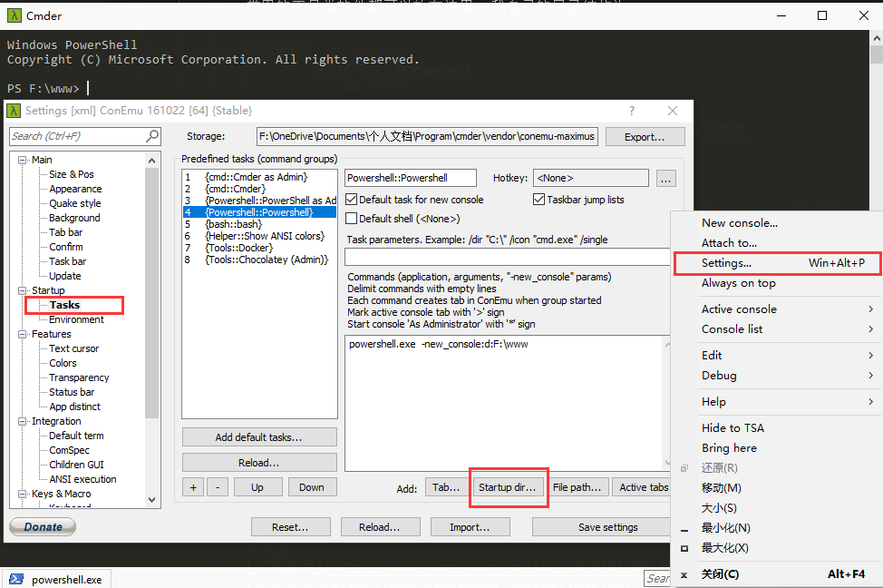
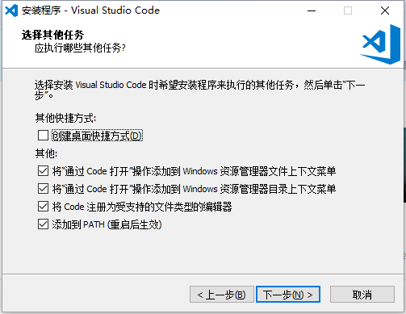
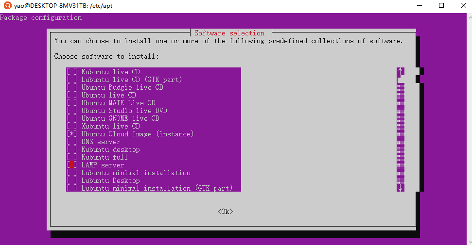
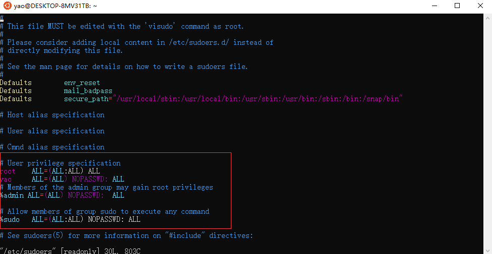
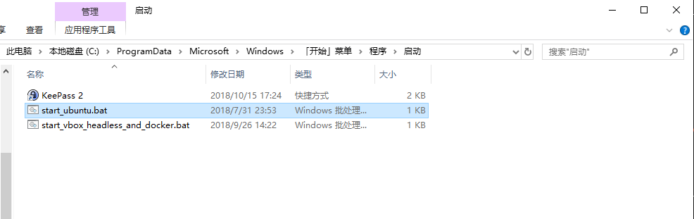
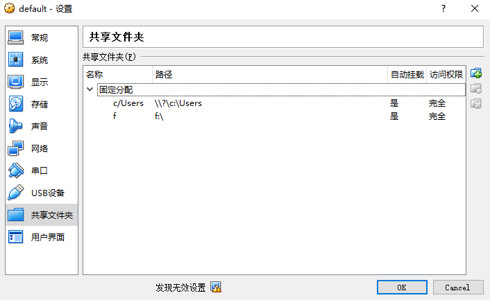
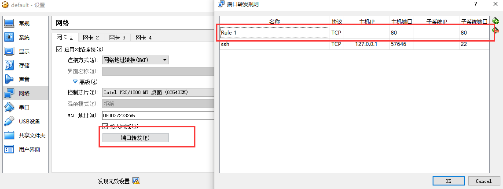

刚才卸 Docker 把电脑卸崩了, 连不上网, 重置一下电脑, 正好记录下 Windows 开发环境的最佳实践.

# 必备软件

1.  OneDrive
    1.  OneDrive 是微软官方云盘, 普通用户有 5G 容量, office365 用户可以升到 1T, 文件自带版本控制功能, 30 天以内的不同版本都可以还原
    2.  一个很重要的功能在于, OneDrive 在系统级别支持同步个人目录下的 Desktop/Document/Picture, 而我们所有个人文件(软件配置/数据库/工作代码)默认都在这三个目录里, 这三个文件夹放在云上, 即使系统重置, 我们也只要重装一遍软件, 装软件时一路 next, 其他啥都不用管(所有配置都在 Document 里(云上), 嗯哼)
    3.  常用的工具类软件都可以放在这里, 我自己的目录结构为
        ```
        OneDrive
            -   文档(对应于Document)
                -   个人文档
                    -   keepass
                        -   password.kdbx 保存的keepass密码数据库, 所有密码均记录在这里
                        -   Chinese_Simplified.lngx keepass中文语言包, 系统重装完直接往`C:/Program Files (x86)/KeePass Password Safe 2/Languages`拷一份
                            -   下载地址: https://downloads.sourceforge.net/keepass/KeePass-2.39-Chinese_Simplified.zip
                    -   Program
                        -   comder
                            -   最好用的PowerShell客户端
                            -   为了方便从comder中直接进入开发目录(F:/www), 可以给www目录在主目录下建个硬链接
                                -   New-Item -Path C:\Users\yaoze\www -ItemType SymbolicLink -Value F:\www
                                -   当然也可以在设置里配置powershell的启动目录, 更省事
                                    -   
                        -   hosts
                            -   对应于Windows的host文件, 保存到云盘上, 这样即使切换到其他电脑也能同步过去
                            -   配置命令为(在管理员权限下的PowerShell中进行操作):
                                -   删除旧Hosts文件
                                    -   rm C:\Windows\System32\drivers\etc\hosts
                                -   在原有位置生成云盘hosts的硬链接
                                    -   New-Item -Path C:\Windows\System32\drivers\etc\hosts -ItemType SymbolicLink -Value F:\OneDrive\Documents\个人文档\Program\hosts
                        -   shadowsocks
                            -   科学上网
                            -   把运行程序放到云盘里, 重置机器, 装完系统, 双击运行. over
        ```
2.  Chrome
    1.  浏览器
    2.  [扩展推荐](https://www.yaozeyuan.online/2018/01/08/2018/01/Chrome扩展推荐/)
    3.  [调试进阶](https://www.yaozeyuan.online/2018/05/18/2018/05/Chrome调试进阶/)
3.  迅雷
    1.  广告虽然多, 但迅雷下载还是最快的
4.  KeePass
    1.  密码管理程序
    2.  程序员会有各种各样的账号密码, 管理账号密码是个问题, 所以对应的最佳实践如下:
        1.  所有账户密码均使用 keepass 生成/管理, 只要记住数据文件的主密码即可
            1.  KeePass 设定上每 15 分钟&锁屏自动锁定, 避免窥屏
        2.  密码数据库存放到云盘上(OneDrive), 避免丢失(OneDrive 有自动同步&版本管理功能, 5G 的免费空间, Mac/Windows 上都能用)
        3.  一共需要记住两个密码:
            1.  Windows 账户密码(OneDrive/Office/Windows 登录/Microsoft 相关服务都是这个账号)
            2.  Keepass 数据库主密码
        4.  然后其他密码用的时候去 KeePass 里找就行
5.  VSCode
    1.  安装时记得勾上
6.  jre-64 位
    1.  java 运行环境, 肯定要装
7.  Python3.7
    1.  Docker Toolbox 需要这个
8.  PHPStrom/WebStrom
    1.  连 IDE 都没用到, 怎么谈软件工程呢
9.  XShell
    1.  专业的 SSH 客户端
10. WSL
11. 运行在 Windows 上的 Ubuntu, 可能是世界上最好用的 Linux 发行版
12. 首先打开 WSL 功能, 在控制面板-程序-启用或关闭 Windows 功能(需要重启)[打开 WSL 功能](./img/wsl/打开wsl功能.png)
13. 在应用商店(Microsoft Store)里, 搜索 ubuntu, 安装 ubuntu18.04[安装 ubuntu18.04](./img/wsl/安装ubuntu18.04.png)
14. 然后进入开始菜单, 点击 Ubuntu 的图标, 就可以自动安装了
15. 安装之后配置阿里云镜像

    - `sudo cp /etc/apt/sources.list /etc/apt/sources.list.backup`
    - `sudo vim /etc/apt/sources.list`
    - ```bash
      deb https://mirrors.aliyun.com/ubuntu/ bionic main restricted universe multiverse
      deb-src https://mirrors.aliyun.com/ubuntu/ bionic main restricted universe multiverse

      deb https://mirrors.aliyun.com/ubuntu/ bionic-security main restricted universe multiverse
      deb-src https://mirrors.aliyun.com/ubuntu/ bionic-security main restricted universe multiverse

      deb https://mirrors.aliyun.com/ubuntu/ bionic-updates main restricted universe multiverse
      deb-src https://mirrors.aliyun.com/ubuntu/ bionic-updates main restricted universe multiverse

      deb https://mirrors.aliyun.com/ubuntu/ bionic-proposed main restricted universe multiverse
      deb-src https://mirrors.aliyun.com/ubuntu/ bionic-proposed main restricted universe multiverse

      deb https://mirrors.aliyun.com/ubuntu/ bionic-backports main restricted universe multiverse
      deb-src https://mirrors.aliyun.com/ubuntu/ bionic-backports main restricted universe multiverse
      ```

16. `sudo apt-get upate`
17. LAMP 环境
    1.  安装 tasksel, `sudo apt-get install tasksel`
    2.  sudo tasksel, 上下左右选择需要安装的服务器, 比如 LAMP 啥的
        1.  
18. 启动 ssh 服务
    1.  命令窗口毕竟没有 XShell 好用, 所以最好还是用 SSH 登录
    2.  WSL 自带的 openssh-server 有点问题. 有的文件没有初始化, 所以需要先卸再装`sudo apt remove openssh-server && sudo apt install openssh-server`
    3.  修改配置文件. Windows 因为历史上曾经有过 ssh-server, 所以子系统里不能使用 22 端口作为标准端口, 编辑`/etc/ssh/sshd_config`, Port 改成 2233, PasswordAuthentication 改成 yes, 允许账号密码登录
    4.  `sudo /etc/init.d/ssh restart` 启动子系统 ssh 服务
19. 开机自动启动 WSL& rc 5 服务
    1.  配置 sudo 不需要密码
        1.  `sudo vim /etc/sudoers`, 添加上自己的用户名, 然后加上 NOPASSWD:
            - 
    1.  在启动文件夹(`C:\ProgramData\Microsoft\Windows\Start Menu\Programs\StartUp`)中添加启动脚本
        ```bat
        "C:\Windows\System32\bash.exe" -c 'sudo service ssh restart'
        ```
        - 目前, Ubuntu16.04 可以直接执行`sudo service rc 5`, 但是 Ubuntu18.04 只能手工指定启动服务, demo => `sudo service ssh restart && sudo service php7.2-fpm restart`
        3.  截图示例
            - 
20. 建立文件夹快捷方式.
    1.  WSL 会把硬盘挂载到/mnt 下边, 但是每次都 cd 进去很麻烦
    2.  所以可以直接 `ln -s /mnt/f/www /home/yao/www`, 在主目录下给开发目录建个链接, over
        1.  我的习惯是独立文件放在 F 盘里, OneDrive/www/微信&QQ 聊天记录
21. 安装 nvm
    1.  毕竟是前端, 专业解决 node 版本问题,
    2.  `wget -qO- https://raw.githubusercontent.com/creationix/nvm/v0.33.11/install.sh | bash`
    3.  然后`nvm install stable && nvm use stable`, over
22. vimrc

    1.  1000 个开发会有 1500 种 vimrc, 我的习惯是在保证可用性的情况下尽可能减少对 vimrc 的依赖. 所以有了这个对外部环境 0 依赖的版本
    2.  功能概述:
        1.  vimrc 中自带使用说明, 对新人友好
        2.  shift+t 打开文件夹浏览窗口, 再按一次关闭
            1.  使用 t 可以在新标签页中打开文件
            2.  ctrl + w 切换浏览区域
            3.  ctrl + b 切换到上个标签页
            4.  ctrl + n 切换到下个标签页
        3.  不会生成 swp 交换文件
        4.  使用空格替换 tab
        5.  配置文件修改后可以自动加载
        6.  光标抵达行首/行尾可以继续向前
    3.  使用方法
        1.  vim ~/.vimrc
        2.  :set paest
        3.  粘贴以下内容:
            ```vimrc
            " 功能说明：
            " 显示行号 => 可使用`set nonumber` 关闭行号显示
            " 不生成swp交换文件
            " 关闭粘贴代码时添加注释的功能
            " 在行头/行尾使用左/右键时自动前往上一行/下一行
            " 在插入模式下, 按 `ctrl+n` 自动补全单词(多个单词可选时使用`↑`、`↓`键选择, 回车确认)
            "
            " 使用方式：
            " 将文件重命名为.vimrc ,置于用户的~目录下
            "
            autocmd! bufwritepost .vimrc source % " vimrc文件修改之后自动加载。 linux。
            " 常规设定
            "set number " 显示行号。
            set ambiwidth=double " 将所有字符显示为全角宽度
            set autoindent " 自动缩进
            set wildmenu " 自动补全的时候，将补全内容使用一个漂亮的单行菜单形式显示出来。
            set whichwrap=b,s,<,>,[,] " 光标从行首和行末时可以跳到另一行去
            set nobackup " 取消备份
            set noswapfile " 不生成交换文件
            autocmd FileType * setl fo-=cro " 关闭自动添加注释的效果
            " 支持鼠标滚动
            " set mouse=a
            colorscheme elflord " 设定颜色主题
            " tab 空格
            set expandtab " 将输入的tab自动转换为空格(默认4个空格)
            set smarttab " 在行首输入tab时自动转换为空格
            set shiftwidth=4 " 缩进时默认的缩进宽度(4个空格)
            " netrw文件浏览器
            set autochdir " 当打开一个文件时，自动切换到该文件所在的目录
            let g:netrw_altv = 1 " 与preview项相配合，在右侧打开预览文件
            let g:netrw_preview = 1 " 在一个垂直列表中打开预览文件
            let g:netrw_liststyle = 3 " 列表模式-文件夹浏览模式
            let g:netrw_winsize = 30 " 文件夹列表的宽度(30个字符)
            let g:netrw_browse_split = 4 " 在当前窗口的新区域内预览文件(与P操作相同)
            " 编写函数实现开关 Vexplore 文件夹列表的效果
            function! ToggleVExplorer()
            if exists("t:expl_buf_num")
                let expl_win_num = bufwinnr(t:expl_buf_num)
            if expl_win_num != -1
                let cur_win_nr = winnr()
            exec expl_win_num . 'wincmd w'
            close
            exec cur_win_nr . 'wincmd w'
            unlet t:expl_buf_num
            else
            unlet t:expl_buf_num
            endif
            else
            "exec '1wincmd w'
            Vexplore
            let t:expl_buf_num = bufnr("%")
            endif
            endfunction
            " 按键 => 指令快捷方式
            map <C-n> :tabn<CR>
            map <C-b> :tabprevious<CR>
            map <S-t> :call ToggleVExplorer()<CR>
            set paste " 复制模式
            ```

23. Vbox
    1.  For Docker
24. Docker Toolbox

    1.  如果考虑高可用的话, Dockerfile 其实才是最好的高可用开发环境
    2.  截止到目前为止(2018 年 7 月), 基于 Hyper-V 的 Docker for Windows 有兼容性问题(只有 Win10 专业版可用), 性能问题(一个页面触发 4 个异步请求, 稳定有 1~2 个请求 404), 所以 Windows 版本上选用的是 Docker Toolbox
    3.  Docker 配置时需要注意三点
        1.  将 Docker 项目所在盘挂在为共享文件夹(避免找不到文件)
            - 
        2.  将 Docker 项目 expose 的端口在虚拟机上绑定好映射
            - 
        3.  需要用 docker-compose 官方最新版本的[release](https://github.com/docker/compose/releases)替换掉 Toolbox 自带的 docker-compose.exe, 否则无法解析有中文注释的 yaml 文件(万恶的 Python 编码问题)
        4.  创建 docker-machine 并配置阿里镜像源
            1.  删除旧机器 => `docker-machine rm default`
            2.  添加新机器并配置阿里镜像源 => `docker-machine create --engine-registry-mirror=https://ns0io9ia.mirror.aliyuncs.com -d virtualbox default`
    4.  自动启动 vbox & docker
        1.  在启动文件夹(`C:\ProgramData\Microsoft\Windows\Start Menu\Programs\StartUp`)中添加 bat 启动脚本
            ```bat
            "C:\Program Files\Oracle\VirtualBox\VBoxManage.exe" startvm "default" --type "headless"
            "C:\Program Files\Docker Toolbox\docker-machine.exe" start default
            echo "等待vbox启动完毕(2分钟)"
            ping 127.0.0.1 -n 120
            echo "启动docker"
            "C:\Program Files\Docker Toolbox\docker-compose.exe" -f "F:\www\ha_develope_env\docker-compose.yml" up -d
            "C:\Program Files\Docker Toolbox\docker-compose.exe" -f "F:\www\docker\docker-compose.yml" up -d
            ```
        2.  截图示例
            - 

25. git/ssh
    1.  打开 PowerShell, 输入 ssh-keygen.exe, 然后把公钥填到 git 上就可以
    2.  公钥可以在 everything 上搜.ssh, 找到对应文件夹, 然后用 VSCode 打开 id_rsa.pub 即可
26. nvm for windows
    1.  windows 上有时也需要跑 node
    2.  [项目地址](https://github.com/coreybutler/nvm-windows/releases)
27. Adobe XC
    1.  可以在 Windows 上查看 Sketch, 免费
28. 2345 看图王 & 2345 好压 & QQ 影音
    1.  日常应用
    2.  好压的文件批量改名很好用
29. 输入法
    1.  只留两种键盘模式, 中文&英文, 平常可以用 Win+空格来回切换
    2.  使用系统内置输入法
        1.  Win10 内置的输入法是[刘未鹏](https://mindhacks.cn/)牵头开发的, 体验上不输搜狗, 而且永远没有广告
        2.  使用其他输入法的问题在于, 切换起来太麻烦, 带来的好处不足以覆盖广告导致的体验下降
    3.  在设置里, 配上中文模式下也使用英文标点, 可以减少 30%的 bug
30. 动图捕捉
    1.  使用[LICEcap](https://www.cockos.com/licecap/)即可
