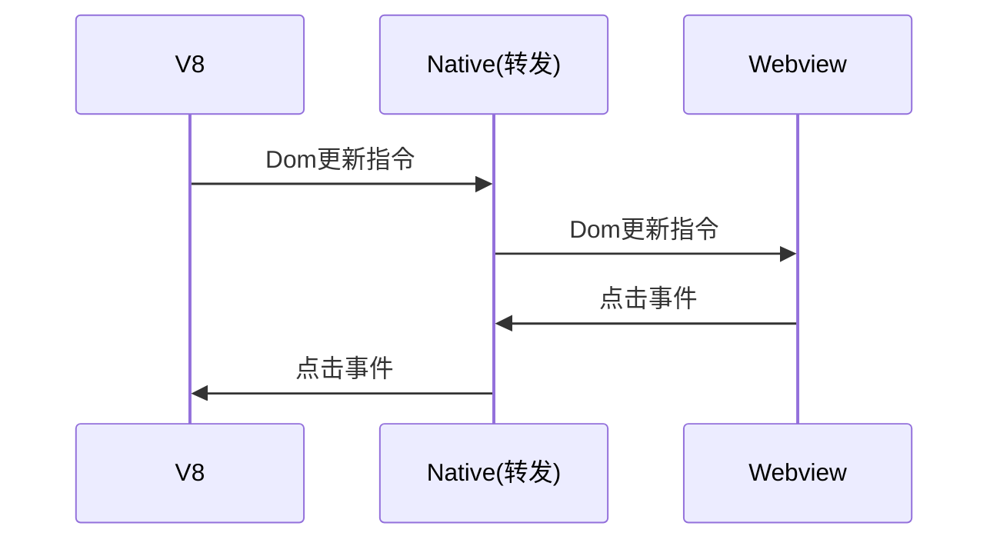
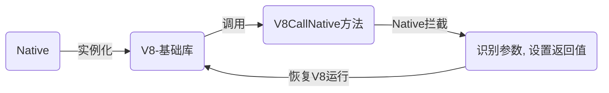
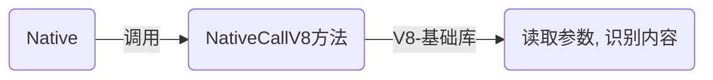
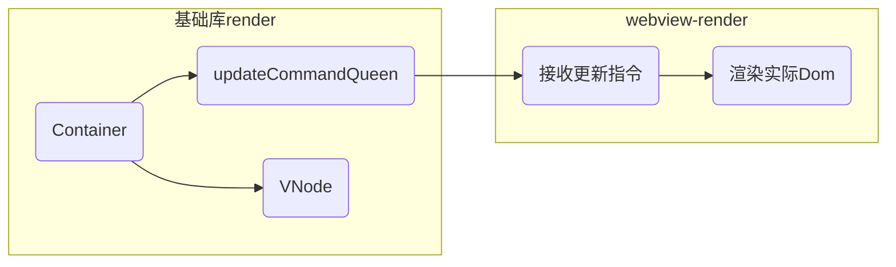

# 微壳小程序运行原理概览

大家好, 我是`前端架构组`的姚泽源, 今天分享下微壳小程序的运行原理概览. 这次分享的由三部分构成.

首先是小程序的基本运行模式和作为配套的平台整体架构.
然后会回答一个大家可能都想过的问题: 为什么我们要开发小程序平台, 为什么不直接用 H5
最后会具体介绍小程序的启动原理. 这一块涉及到自定义渲染器和 React 项目启动流程探索, 相信大家会比较感兴趣.

时间不多, 我们开始吧

# 整体概览

## 小程序介绍

先介绍下微壳小程序. 微壳小程序是`前端架构组`负责的贝壳开放能力, 开发者可以利用小程序, 在贝壳系 App 中添加自己的应用. 简单来说小程序就是:

- 一个基于 React 编写
- 运行在 App 内
- 安全可控易用的富能力网页应用.

大家可以把它理解成是贝壳版的微信小程序.

# 启动流程

微壳小程序通过 App 启动. 主要依赖`推荐列表`和`小程序详情`两个接口. App 会首先调用`推荐列表`接口展示小程序广场,


当用户点击广场上的小程序 icon 时, 会调用`小程序详情`接口获取`小程序id`对应的`静态资源包地址`和资源包的`md5校验值`. App 先检查本地是否有`小程序id`和`md5校验值`一致的静态缓存, 有就直接用本地资源, 否则则清空缓存, 重新下载静态资源. 通过提前下载静态资源并保留缓存的方式, App 可以做到`一次加载, 全程秒开`. 用户体验上秒杀普通网页应用.

# 整体技术架构概览

## 基础模型

App 从静态资源包中解压出的文件目录如图所示

```md
- static
  - css
    - main.css
  - main.js
- index.html
```

很显然, 这是一个典型的`js/css/html`结构的网页应用. 但和普通网页不同, 小程序在运行时, 逻辑层和渲染层是分开的.


启动小程序时, Native 会启动一个 V8 引擎和一个 webview 实例. V8 负责运行`main.js`文件作为逻辑层, webview 用于载入`html`和`css`文件作为表现层对外展示. 切换页面时, V8 不变, 只新增或销毁 webview 实例. 切换 webview 在本地执行, 消耗时间可以忽略不记, 也不会有网页应用中常见的页面切换白屏问题.

需要特别说明的是, 在这套架构中, V8 中的 js 代码无法接触 webview 中的实际 Dom , 只能通过 Native 传递消息指令进行通信. 目前的微信/QQ/百度/头条/支付宝/钉钉/京东/快手小程序也都是这类架构, 换句话说, 这是业内小程序平台的通用架构. 逻辑层和渲染层相隔离是小程序架构最典型的特征, 也是后续面临的所有的问题之源. 我会在分享的第二部分解释我们选择这种模式的原因.

## 周边配套

为了在这套架构上开发运行小程序, 我们还需要一些周边基础设施. 这里简单介绍下.

| 面临问题                                                   | 解决方案                  |
| :--------------------------------------------------------- | :------------------------ |
| 运行环境特殊(运行在 V8 中/没有全局函数/无法接触 dom)       | 模拟运行环境 => `IDE`     |
| js 无法操作 Dom & 业务确实有操作 Dom 的需求(Picker/Canvas) | 封装 Dom 操作 => `组件库` |
| 提供调用原生能力                                           | 逻辑层=> 基础库           |
| 在 webview 中实际生成 Dom                                  | 渲染层=> 渲染器           |
| 原生应用接入                                               | 编写 App 运行时           |
| 支持移动端多产品线(20+)                                    | 小程序 SDK                |
| 支持小程序 `注册/审核/发布` 流程                           | 提供`服务端`支持          |

首先, 由于 js 不能直接操作 DOM, 传统基于浏览器页面的开发方式无法模拟这种实际运行环境, 所以我们需要开发专门的 IDE 模拟小程序环境. 屏蔽几乎所有的全局函数, 禁止 js 直接接触 dom, 同时模拟小程序基础库提供的的原生 API 调用.

其次, 虽然 js 无法操作 DOM, 但实际业务开发中也有必须直接操作 dom 的场景(例如 picker 选择器, 需要实时计算选项元素位置, 使用元素的 scrollTo 事件; canvas 应用, 需要使用 canvas 对象进行绘图操作). 为了解决这个问题, 我们还要引入组件库. 由架构组将需要 Dom 操作的组件封装为普通组件, 在组件库执行 dom 操作. 而业务方则直接使用组件库提供的通用标签, 通过 API 获取组件响应结果.

小程序支持调用原生能力, 负责提供原生能力的 npm 包称为基础库, 在 webview 中负责生成实际 dom 的称为 webview-render, 这两个也需要开发.

小程序需要运行在原生应用内. 所以 App 内也需要单独写一套运行环境. 又因为贝壳有 20 多个 App 产品线, 所以这套运行环境还需要被整理成 sdk 供各个业务线接入.

App 完成后, 启动小程序需要服务端提供接口获取相关配置信息. 然后也需要一套流程去进行小程序的注册, 提交, 审核, 发布流程. 这是小程序的服务端.

可以看到, 如果我们以逻辑层和渲染层必须隔离作为前提的话, 上边提到的技术栈都要配备开发人员, 给实际开发带来非常高的成本, 而且最后页面还是呈现在 webview 上. 那我们为什么不退一步, 用 webview 渲染, 也就是说, 直接用 h5 页面提供功能. 这样开发方便, 接入方便, 推广难度几乎为 0----毕竟我们平常写的就是 H5. 那么, 为什么我们会采用这种小程序架构呢?

# 小程序架构的关键考量

有观点认为页面打开速度快, 是小程序的优势. 但小程序的快速打开能力是通过缓存静态资源实现的, 如果只是追求打开速度, ReactNative 也能实现. 当然, ReactNative 项目不稳定, 功能不足, 到现在官方也没有提供视频播放支持. 但问题是我们也可以考虑魔改 webview 或者 PWA 嘛. 首次打开时自动缓存特定域名下的静态资源, 二次启动时一样可以实现秒开, 开发成本还更低. 所以, 页面打开速度不是决定小程序技术选型的关键.

也有同学认为小程序可以调用原生 API, 实现 H5 无法完成的功能, 认为这是小程序的优势. 但这个功能 jsbridge 就可以做. jsbridge 也是 h5 页面, 而且公司现在就有这种项目. 所以, 这也不是技术选型的关键.

实际上, 不光我们在怀疑, **微信也是这么想的, 而且也是这么做的**, 但为什么微信后来义无反顾地开启了小程序时代呢, (这一切的背后, 是人性的扭曲还是道德的沦丧), 让我们看看微信的理由.

先来看事情的背景: 微信作为流量平台, 需要开发者利用微信能力在平台上开发应用. 为了方便开发者, 微信 2015 年年初提供了 jsbridge 并赋予开发者权限. 但他们很快就遇到了两个问题.

1.  首先, 作为网页, 天然就有白屏问题. 首次加载时白屏, 页面跳转时也会白屏, 用户体验不佳
2.  其次, 由于网页内容无法控制, 所以出现了各种神奇页面. 给微信带来了巨大的安全风险


针对这种情况, 微信第一反应就是针对违规页面进行封禁. 但 H5 页面的基本单元只有域名, 而搞黑产的根本不缺域名, 导致平台风控变成了打地鼠游戏, 防不胜防. 就在微信运营团队左支右拙忙的焦头烂额之际, 2015 年 9 月, 一家新注册的公司让微信彻底放弃了挣扎的念想.


实际上, 只要允许开发者接触 Dom 环境, 开发者能想出 100 种方法把页面玩出花. 考虑到平台能力开放后的巨大风险, 安全可控成了微信对于第三方页面应用最大的诉求, 具体来说, 是以下三项

> 1.  不允许开发者把页面跳转到其他在线网页(拼多多你够了)
> 2.  不允许开发者直接访问 DOM(iframe 也不行)
> 3.  不允许开发者随意使用 window 上的某些未知的可能有危险的 API(白名单是最好的防御)


在这种情况下, 逻辑层和表现层完全分离的双进程方案, 就成了小程序架构的必然选择.

| 问题描述    | 解决方案                                                    |
| :---------- | :---------------------------------------------------------- |
| 安全风险    | 按开发者主体进行审查. 小程序先审核, 后上线                  |
| js 潜在漏洞 | 逻辑代码和实际 Dom 相隔离, 只能使用审核过的(白名单)全局函数 |
| 页面白屏    | 本地整体打包缓存缓存静态资源                                |

- 通过限定 js 文件只能在 V8 容器中运行, 对业务方可调用的全局函数采用白名单模式, 解决了 js 本身带来的风险
- 引入发布机制后, 开发者所需的静态资源可以被预先声明或缓存, 页面加载和切换过程中可以展示过度动画, 解决了页面打开过程中的白屏问题, 优化了用户体验.
- 通过注册审核机制, 可以对平台应用进行预先审查, 对违规开发者按照申请主体进行封禁, 解决了域名模式下风险管控事实性瘫痪的问题.
- 最关键的, 通过注册审核制, 页面开发者的身份得到了保证, 为更多深度功能的开放提供了前提.
  - 微信的国务院政务平台小程序
  - 支付宝的电子医保卡小程序

**贝壳作为房产平台, 如果想向行业开放自己的能力, 也需要一套这样的小程序平台去为业务方赋能.**

也就是说,小程序平台对贝壳而言, 是必须的

# 技术实现: 在逻辑层表现层相互隔离的限制下, 如何启动小程序

确认了这个前提之后, 我们就可以讨论下一个问题: 小程序是如何在不接触到展示层的前提下跑起来的?

最简单的回答当然是: 小程序就是 V8 中生成 Dom 构建指令发给 webview, webview 将页面事件传给 V8. 两者相互协助, 形成整个应用.




当然可以, 但在讲解启动流程前, 我们需要先介绍两项小程序依赖的基础能力.

# 问题一: V8 引擎 和 webview 的通讯实现.

第一个问题, V8 ,Native 和 webview 间如何通信?

答案是利用 Native 作为中间层, V8/webview 和 Native 分别通过全局函数进行通信.

V8 <---> Native <---> webview



考虑到 V8 和 webview 都是由 Native 创建出的 js 运行环境实例, 所以 webview 和 Native 间的通信原理和 V8 和 Native 间的通信原理基本一致, 我们只讲下 V8 和 Native 的通信过程实现.

由于 V8 是 Native 创建出的实例, 因此 Native 可以监控 V8 里的函数调用, 也能直接调用 V8 中的函数. 因此, 我们可以约定一个全局函数名, 例如 V8CallNative. 当基础库在 V8 中调用该函数时, Native 会暂停 V8 的运行, 然后解析传给 V8CallNative 的参数. 在实践中, 我们规定这个参数一定是 json 形式并有以下结构

```ts
type Protocol = {
  id: number; // 递增的函数调用id, 作为函数身份标记
  apiName: string; // 实际调用的API名
  callbackName: string; // 处理完成后V8中用于接收结果的回调函数名
  argvListJson: string; // Json化后的参数列表
};
```

一般情况下, 由于 V8CallNative 函数执行期间 V8 处于暂停状态, 时间长了会影响页面的响应速度. 所以对于大多数请求, Native 拿到参数后就会设置 V8CallNative 函数的返回值并恢复 V8 的运行, 避免影响 V8 业务. 所以这也是小程序内的 API 基本都要靠回调获取结果的原因. 至于为什么接口回调不是 Promise 形式, 这主要要怪微信...出于降低学习成本考虑, 小程序平台 API 一般要和微信的 API 进行对齐, 而由于微信本身是 callback 形式, 导致我们在设计时也只能设计成 callback 形式的 API.



继续看 V8 和 webview 的通信实现. 对 V8 来说, 向 Native 通信实质上是调用被 Native 监听的 V8CallNative 函数, 而 Native 向 V8 通信则是调用被基础库主动暴露在全局变量上的 NativeCallV8 方法. webview 和 Native 的通信也是这个原理. 而通过 Native 中继, V8 和 webview 也可以实现互相通信. 这是后续所有操作的基础.

然后是第二个问题: 如何生成 Dom 更新指令

# 实现自定义 React-Render

我们知道, 在 react 的更新流程里, 我们编写的 jsx 代码在状态(state)更新后, 会首先 render 出`虚拟dom`, 然后 react 会把`新虚拟dom` 和`旧虚拟dom`进行比较, 得到从旧模型到新模型的操作步骤, 然后由渲染器将虚拟 dom 操作转换成浏览器里实际 Dom 的生成操作, 生成实际 Dom.

jsx setState-> vdom -> 比较得出更新指令 -> render -> 操作实际 dom -> real dom

这是我们对 react 更新流程的直觉印象. 用官方描述来说, react16 后的架构模型(Fiber )是这样[^出处_【2万字长文】深入浅出主流的几款小程序跨端框架原理]

React component API <----> Reconciler 调和器 <----> Renderer 渲染器


| 类别                | 功能                                                                           |
| :------------------ | :----------------------------------------------------------------------------- |
| React Component API | 公开 API, 通过**import React from 'react'** 导入                               |
| Reconciler 调和器   | Fiber 模型核心, 实现了时间分片/优先级调度/节点 diff 等算法, 输出操作以更新节点 |
| Renderer 渲染器     | 执行更新操作, 渲染实际对象                                                     |

组件 API 是我们了解的 setState / compontentDidUpdate 这种生命周期函数.

在代码实际运行时, 组件的 setState 和 hooks 函数会被替换为 Reconciler 调和器中的实现. 这样, 当组件状态的变化会被 Reconciler 调和器监听到.[^出处_react源码剖析：react/react-dom/react-reconciler的关系]

Reconciler 调和器是 Fiber 模型的核心, 内部实现了时间分片/优先级调度/Fiber 节点 diff 等一系列算法. 这些我们都可以视为黑盒, 只要知道 Reconciler 的输入是 react 组件的状态更新, 输出是对渲染器的实际操作指令就可以了.

Reconciler 在计算完成后, 会调用 Renderer 渲染器上的方法. 这些方法包括不限于:

```jsx
createInstance; // 创建节点实例
createTextInstance; // 创建文本节点

appendChild; // 在实例下添加子节点
removeChild; // 在实例下删除子节点

appendChildToContainer; // 在根容器内添加子节点
removeChildFromContainer; // 在容器内删除子节点
```

这些方法合称为 [HostConfig](https://github.com/facebook/react/blob/main/packages/react-reconciler/src/forks/ReactFiberHostConfig.custom.js), 相当于调和器和渲染器之间的协议. HostConfig 本身是一个具有以上方法的普通对象, 调和器实例化时接收这个对象, 然后会按实际需要调用 HostConfig 上的接口. HostConfig 收到请求后, 转调渲染器中的方法. 而渲染器的任务就是实现这些方法, 在平台上渲染出实际节点.


但这里要注意下, 根据 HostConfig, 我们只要求渲染器实现`createInstance`/`appendChild`这些方法, 但没要求这些方法具体怎么实现. 像 `appendChild` 这种 dom 对象上直接就有的方法, 在 web 平台上写渲染器当然方便, 但要是我在 iOS 平台上也实现一套 HostConfig 协议呢?

当然没问题.

- Facebook 在 Android/iOS 上实现了一套 HostConfig, 就是我们所知的 ReactNative.
- 微软在 Windows 平台上实现了一套 HostConfig, 就是 react-native-windows
- 除此之外, 还有 react-canvas/react-tv/react-sketchapp/react-test-renderer

github 上有人专门整理了一份[awesome-react-renderer](https://github.com/chentsulin/awesome-react-renderer), 是基于 HostConfig 实现的在各个平台上的渲染器, 把常见的平台都覆盖了, 很震撼.

| 平台           | 项目名                                                                                          |
| :------------- | :---------------------------------------------------------------------------------------------- |
| 移动端         | [react-native](https://github.com/facebook/react-native)                                        |
| 桌面端         | [react-native-windows](https://microsoft.github.io/react-native-windows/)                       |
| canvas         | [react-canvas](https://github.com/Flipboard/react-canvas)                                       |
| 电视           | [react-tv](https://github.com/raphamorim/react-tv)                                              |
| Test Utilities | [react-test-renderer](https://github.com/facebook/react/tree/main/packages/react-test-renderer) |

# 微壳小程序渲染器构建

回到我们的问题. 既然我们可以基于 React 构建自己的 render, 那对于微壳小程序来说, 我们需要做什么?



很显然, 我们需要两个 render.

第一个 Render 构建在 V8 内部, 他要实现一个 Container 容器供 Reconciler 调用, 实现一个 VNode 类供 Container 创建 VNode 节点树. Container 中还要有一个 updateCommandQueen 队列, 用于在 Reconciler 调用 Container 的方法时, 记录下节点更新序列. 在一个更新周期完成后(调用了 HostConfig 中规定的`resetAfterCommit`方法), 将更新队列 JSON 化成字符串, 通过 Native 发送给 webview

```tsx
// VNode数据结构定义(部分)
class VNode {
  id: number;
  container: Container;
  text?: string;

  removeChild(node: VNode, immediately: boolean);
  insertBefore(node: VNode, referenceNode: VNode, immediately: boolean);
  update();
  toJSON();
}
```

```tsx
// 更新指令定义
interface TypeSpliceUpdate {
  /**
   * 操作类型
   */
  actionType: TypeActionType;
  path: string;
  start: number;
  deleteCount: number;
  items: VNode[];
}
```

在 webview 中, 我们需要一个简单的 render, 根据更新指令列表, 创建真实的 Dom 元素...就完了?

还差一步. 但在点出差的那一步之前, 我们先回顾下微壳小程序启动的实际流程.

# 微壳小程序启动的实际流程

1.  首先, 小程序构建器会将 app.json 翻译成实际的入口文件

```json
{
  "pages": ["pages/page1/index", "pages/page2/index"],
  "debug": true,
  "appId": "_undefined_"
}
```

```tsx
import Entry_048f08fe8 from "F:/www/test/pages/page1/index.tsx";
import Entry_048f08fe8_Config from "F:/www/test/pages/page1/index.json";
import Entry_5924e300d from "F:/www/test/pages/page2/index.tsx";
import Entry_5924e300d_Config from "F:/www/test/pages/page2/index.json";
export default {
  // 页面入口
  pages: [
    {
      path: "pages/page1/index",
      entry: Entry_048f08fe8,
      config: Entry_048f08fe8_Config,
    },
    {
      path: "pages/page2/index",
      entry: Entry_5924e300d,
      config: Entry_5924e300d_Config,
    },
  ],
  // 原app.json内容
  appJson: {
    pages: ["pages/page1/index", "pages/page2/index"],
    debug: true,
    appId: "_undefined_",
  },
};
```

2.  在生成的入口配置文件中, 我们能拿到页面路径和实际 render 函数之间的对应关系, 据此可以生成路由配置.
3.  小程序启动时, 首先载入的是 app.ts 文件. 文件内容很简单, 就是调用 App 函数

```ts
import { App } from "@ke/miniprogram";

// 初始化项目
App();
```

4.  在 App 函数只做两件事: 第一, 根据实际入口文件初始化路由, 第二, 调用 Native 方法, 通知小程序 js 启动完毕.

```jsx
function App(options?: AppOptions) {
  if (initRouter(options)) {
    bridge.v8CallNative({
      apiName: "onAppLaunch",
      callbackName: "onAppLaunchCallback",
    });
  } else {
    throw Error();
  }
}
```

1.  Native 收到通知, 得知 V8 中的 js 加载完毕后, 调用 V8 中基础库的 onShow 回调, 同时在回调中传入页面参数, 通知小程序可以开始进行 dom 渲染.
2.  基础库 在 onShow 回调中拿到路由参数后, 调用`NavigateTo`开始渲染实际页面

```tsx
static navigateToCallback(json: object) {
  // ...
  const callbackObj = json['apiName'];
  const params = json['params'];
  const parseParams = JSON.parse(decodeURIComponent(params));
  createPageContext();
  // ...
}

```

7.  具体执行流程如下

    1.  创建`Container`容器实例
        ```tsx
        export default function createPageContext(type: string) {
          // ...
          const path = result["path"];
          const query = result["query"];
          // 拿到path对应页面的渲染函数
          const pageJsx = getPageJsx(path);
          // 创建container
          const container = new Container();
          // 页面实例
          const pageInstance = createPageConfig(pageJsx, container);
          // 触发load事件, 触发生命周期, 载入组件元素
          pageInstance.onLoad(query);
          // ...
        }
        ```
    2.  执行`createPageConfig(Page: React.Component, container: Container)`方法, 创建页面实例. Page 参数为路径对应的渲染函数, Container 为第一步创建的容器实例. 一步步跟踪, 可以看到`createPageContext`->`createPageConfig`->`createAppConfig`->`render`的调用链.

        ```tsx
        // createPageConfig实现示例
        let app = createAppConfig(({ children }) => children);

        export default function createPageConfig(
          Page: React.Component,
          container: Container
        ) {
          const config: any = {
            onLoad(this: any, query: any) {
              const PageWrapper = createPageWrapper(Page, query);
              this.pageId = generatePageId();

              this.query = query;
              this.container = container;
              this.element = createPortal(
                React.createElement(PageWrapper, {
                  page: this,
                  ref: this.wrapperRef,
                }),
                this.container,
                this.pageId
              );

              app._mount(this);
            },
          };

          return config;
        }
        ```

        ```tsx
        // createAppConfig实现示例
        export default function createAppConfig(this: any, App: any) {
          const createConfig = (
            AppComponent: React.ComponentType<any> = DefaultAppComponent
          ) => {
            const config: any = {
              _container: new Container(this),

              _pages: [] as any[],

              _mount(pageInstance: any) {
                this._pages.push(pageInstance);
                this._render();
              },

              _render(query) {
                const props: any = Object.assign({}, query);

                return render(
                  React.createElement(
                    AppComponent,
                    props,
                    this._pages.map((p: any) => p.element)
                  ),
                  this._container
                );
              },
            };

            return config;
          };

          return createConfig(App);
        }
        ```

        **最终会跟踪到创建调和器 Reconciler 实例部分**

        ```tsx
        // render实现示例

        import ReactReconciler from "react-reconciler";
        import hostConfig from "./hostConfig/index";

        // 创建调和器实例, 创建时需要传入 HostConfig 以调用 Container 中的方法
        export const ReactReconcilerInst = ReactReconciler(hostConfig as any);

        export default function render(
          rootElement: React.ReactElement | null,
          container: Container
        ) {
          // Create a root Container if it doesnt exist
          if (!container._rootContainer) {
            container._rootContainer = ReactReconcilerInst.createContainer(
              container,
              false,
              false
            );
          }
          // 开始 react 更新流程. 在更新流程中, 将 setState/reactHooks 的实现替换为`react-reconciler`内部函数, 从而实现对变动的监控
          ReactReconcilerInst.updateContainer(
            rootElement,
            container._rootContainer,
            null,
            () => {
              // ignore
            }
          );

          return getPublicRootInstance(container._rootContainer);
        }
        ```

        在 ReactReconcilerInst.updateContainer 中, 会对 setState/reactHooks 的实现进行替换. React 中的相关代码如下(基于React@16.7.0)

        &nbsp;

        **setState 替换过程追踪**

        ```js
        // [setState实现](https://github.com/facebook/react/blob/v16.7.0/packages/react/src/ReactBaseClasses.js#L58-L67)
        Component.prototype.setState = function (partialState, callback) {
          this.updater.enqueueSetState(
            this,
            partialState,
            callback,
            "setState"
          );
        };
        ```

        ```js
        // [updater来源](https://github.com/facebook/react/blob/v16.7.0/packages/react/src/ReactBaseClasses.js#L21-L29)
        function Component(props, context, updater) {
          this.props = props;
          this.context = context;
          // If a component has string refs, we will assign a different object later.
          this.refs = emptyObject;
          // We initialize the default updater but the real one gets injected by the
          // renderer.
          this.updater = updater || ReactNoopUpdateQueue;
        }
        ```

        ```ts
        // [实例化Component时对updater的替换-1-初始化类实例](https://github.com/facebook/react/blob/v16.7.0/packages/react-reconciler/src/ReactFiberClassComponent.js#L567)
        function constructClassInstance(
        workInProgress: Fiber,
        ctor: any,
        props: any,
        renderExpirationTime: ExpirationTime,
        ): any {
        ...
        const instance = new ctor(props, context);
        const state = (workInProgress.memoizedState =
            instance.state !== null && instance.state !== undefined
            ? instance.state
            : null);
        adoptClassInstance(workInProgress, instance);
        }
        ```

        ```ts
        // [实例化Component时对updater的替换-2-替换updater](https://github.com/facebook/react/blob/v16.7.0/packages/react-reconciler/src/ReactFiberClassComponent.js#L504)
        function adoptClassInstance(
          workInProgress: Fiber,
          instance: any
        ): void {
          instance.updater = classComponentUpdater;
          workInProgress.stateNode = instance;
          // The instance needs access to the fiber so that it can schedule updates
          setInstance(instance, workInProgress);
          if (__DEV__) {
            instance._reactInternalInstance = fakeInternalInstance;
          }
        }
        ```

        **useState(hooks) 替换过程追踪**

        ```ts
        // [useState定义](https://github.com/facebook/react/blob/v16.7.0/packages/react/src/ReactHooks.js#L54-L57)
        export function useState<S>(initialState: (() => S) | S) {
          const dispatcher = resolveDispatcher();
          return dispatcher.useState(initialState);
        }
        ```

        ```ts
        // [resolveDispatcher定义](https://github.com/facebook/react/blob/v16.7.0/packages/react/src/ReactHooks.js#L16-L23)
        function resolveDispatcher() {
          const dispatcher = ReactCurrentOwner.currentDispatcher;
          invariant(
            dispatcher !== null,
            "Hooks can only be called inside the body of a function component."
          );
          return dispatcher;
        }
        ```

        ```ts
        // [在渲染根节点时完成对currentDispatcher的替换-renderRoot. 对应于架构图详情中的renderRootSync/renderRootConcurrent](https://github.com/facebook/react/blob/v16.7.0/packages/react-reconciler/src/ReactFiberScheduler.js#L1211-L1125)
        function renderRoot(root: FiberRoot, isYieldy: boolean): void {
        ...
        if (enableHooks) {
            ReactCurrentOwner.currentDispatcher = Dispatcher;
        } else {
            ReactCurrentOwner.currentDispatcher = DispatcherWithoutHooks;
        }
        ...
        }
        ```

        **Reconciler 调和器调用组件实例启动 react 渲染流程的代码**

        ```ts
        // [react-conciler调用组件实例生命周期示例](https://github.com/facebook/react/blob/v16.7.0/packages/react-reconciler/src/ReactFiberCommitWork.js#L457-L461)
        function commitLifeCycles(){
        ...
        instance.componentDidUpdate(
            prevProps,
            prevState,
            instance.__reactInternalSnapshotBeforeUpdate,
        );
        ...
        }
        ```

在这套流程里, 我们挂载上了组件, 准备好了监听组件的变动情况, 也能正常回调组件生命周期函数...但是, 用户输入在哪儿获取?

在 jsx 中, 我们获取用户输入用一般是给 onClick, onInput 事件绑定处理函数, 但我们给 webview 传过去的是字符串形式的构建指令, 而且事件处理函数中依赖的环境变量也不能传到 webview 里, 这时候该怎么办?

答: 不能传递函数, 但是我们可以传递函数名.

在生成 Dom 构建命令时, 我们会建立一个事件处理函数映射表, 函数名命名规范为`${事件名}_${递增计数器}_handler`. 在 webview 中则用 addEventListener 为对应 dom 节点绑定事件处理函数. 当事件发生时, 把 event 对象中的数据和需要调用的参数名通过 Native 传回 V8 引擎, 然后 V8 调用对应的实际函数, 触发组件状态变更, 组件重新渲染, 小程序运行流程形成闭环.

# 收尾

上边这些是对微壳小程序整体技术架构的简单介绍. 小程序的实际开发中涉及到了很多技术点, 这里先列一下, 以后有机会的话可以继续分享

- 基础库
  - 路由管理实现细节
  - Native API 实现细节
- 组件库
  - 为什么一定要基于 shadowdom 构建组件库
- IDE
  - 小程序运行环境如何实现
  - Electron 打包发版/自动更新实现
- Native
  - 底层实现流程(V8 引擎订制过程/webview 管理/...)
- so many...

# 参考资料

[微信小程序技术原理分析](https://zhaomenghuan.js.org/blog/wechat-miniprogram-principle-analysis.html)
[React 源码学习](https://nuzhi.site/react-3renderer#6be02729ab9e4eba94704242ec565819)
[小前端读源码 - React 组件更新原理](https://zhuanlan.zhihu.com/p/59831684)
[Beginners guide to Custom React Renderers](https://blog.atulr.com/react-custom-renderer-1/#references)

[^出处_微信小程序基础架构浅析]: https://cloud.tencent.com/developer/article/1833749
[^出处_【2万字长文】深入浅出主流的几款小程序跨端框架原理]: https://juejin.cn/post/6881597846307635214#heading-24
[^出处_react源码剖析：react/react-dom/react-reconciler的关系]: https://zhuanlan.zhihu.com/p/266892192
