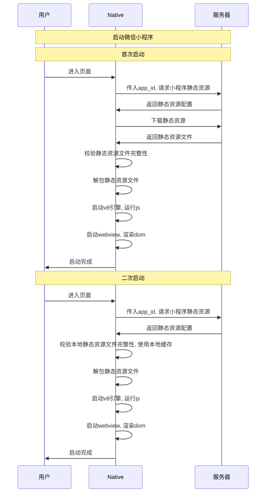
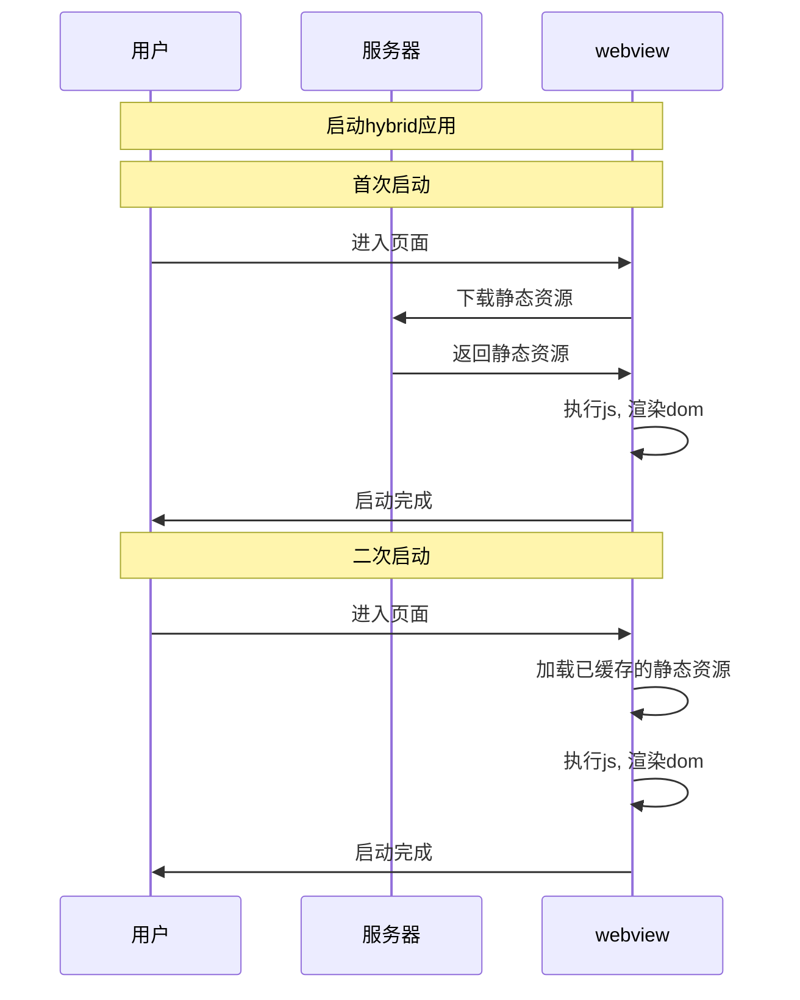

> 假设有天老板找到你, 笑眯眯的说: "小王啊, 你看微信百度支付宝都有自己的小程序平台了, 我们什么时候搞个呢?"

假设有天老板找到你, 笑眯眯的说: "小王啊, 你看微信百度支付宝都有自己的小程序平台了, 我们什么时候搞个呢?" 这时你会...

# 什么是小程序

评估我们是否需要小程序, 首先得定义什么才是小程序

按照微信的解释, 小程序是一种特殊的网页应用. 传统模式下, 逻辑层(js)和渲染层(dom)都在同一页面上执行, 但在小程序里, 逻辑层运行在 jsCore, 渲染层运行在 webview, 互相不能接触, 而且 jsCore 中只提供了 ECMAScript 规范中定义的语言支持, 除此之外, 无论是浏览器环境中的 Dom/window, 还是 Node.js 中提供的 fs/path 模块, 统统欠奉. 但作为补偿, 微信提供了 wx 对象, 向逻辑层暴露了大量原生能力, 通过 wx 对象和微信平台本身的支持, 小程序最终实现了以下效果[出处*微信官方文档*小程序技术发展史](https://developers.weixin.qq.com/miniprogram/dev/framework/quickstart)

> - 快速的加载
>
> - 更强大的能力
>
> - 原生的体验
>
> - 易用且安全的微信数据开放
>
> - 高效和简单的开发

| 运行环境         | 逻辑层         | 渲染层            |
| :--------------- | :------------- | :---------------- |
| iOS              | JavaScriptCore | WKWebView         |
| 安卓             | V8             | chromium 定制内核 |
| 小程序开发者工具 | NWJS           | Chrome WebView    |

# 小程序的优势与劣势

上边的收益当然很好, 但在技术选型前, 我们得先确认下边三个问题

- 在当前技术方案下, 实现这些收益, 我们需要付出那些成本?

- 有没有其他的方案也能实现这些收益?

- 在所有可能的解决方案中, 哪一种是收益成本比最高的? 为什么

所以, 第一个问题: 如果选择微信小程序方案, 我们需要付出那些成本?

## 微信小程序方案的成本

在微信小程序的模型里, 由于逻辑层不能与渲染层接触, 也就不能使用传统浏览器页面的方式开发小程序. 为了模拟这种环境, 我们需要开发专门的环境模拟器, 屏蔽几乎所有的全局函数, 禁止 js 接触 dom, 同时还要模拟小程序基础库提供的开放能力 API----简单来说, 我们需要开发**一套 IDE 系统**.

其次, 虽然 js 无法操作 dom, 但实际业务开发中也有必须操作 Dom 的场景, 比如 Picker 的 scroolTo, 比如 Canvas. 为了提供这些能力, 我们需要一个中间层把 Dom 操作封装为组件对象, 在逻辑层和渲染层之间转发操作指令和执行结果, 换句话说, 得开发**一套组件库**

接着, 由于逻辑层不能接触渲染层, 但最终还要渲染出来界面, 所以我们需要设计一套系统(类似虚拟 dom/vue 模板/jsx/...), 把逻辑层的操作映射为渲染层的实际 Dom, 这是**一个 webview-render**

除了 webview-render 之外, 微信还要向逻辑层暴露原生能力, 这样就需要一层中间层在逻辑层和原生应用之间转发操作指令和运行结果, 也就是**一套基础库**.

原生功能肯定是 Android/iOS 两端都要提供, 这样又至少需要**一名 Android 开发**和**一名 iOS 开发**, 如果公司有多个产品线(微信/微信-Windows/微信-Mac/企业微信/QQ/QQ 精简版/QQ 极速版/...), 那么还需要开发一套**小程序 SDK**, 用于在多个平台间共享小程序能力

以上这些是小程序的硬件需求, 除此之外, 小程序的创建/预览/上传/审核/发布都需要一个后台进行交互, 所以我们还需要**一个小程序后台系统**

总结一下, IDE 需要一个人, 组件库需要一个人, 基础库+设计模板语法规范+编写 webview-render 需要一个人, Android 一人 iOS 一人, 小程序后台也需要一个人, 再加一名技术经理, 总计 7 个人力, 开发半年出 demo 算, 当第一版小程序平台上线时, 总成本大约是 7 \*6 => 42 个高级工程师的人月. 而且, 这只是一个 demo, 不包括后期的推广成本维护成本

## 有没有其他方案可以实现小程序的效果

考虑到能开发 IDE(一般是订制 VSCode)的工程师的薪资水平, 42 个人月的成本是相当可观的. 所以我们自然会问, 没有其他方案可以实现小程序的期望目标吗?

当然有, 小程序方案成本高企的根源, 其实只有一条: 逻辑层和渲染层相分离. 如果允许逻辑层直接操作 Dom, 那么

- 不需要开发专门的环境模拟器, 直接传统方案开发即可
- 不需要开发组件库, 直接操作 Dom 即可
- 不需要设计模板语法, 不需要编写 webview-render, 让 js 直接操作 dom 即可

js 调用原生能力的接口还是需要, Android/iOS 开发也需要, 后台开发可有可无. 如果把调用原生能力的 js 传到 cdn 上对外开放, 允许开发者用自己的域名发布应用的话, 那后台开发也可以省掉.

唯一的问题是...

**这不就是 js-bridge/hybrid 吗???**

当然是 js-bridge, 这没有什么. 作为一名成熟的技术人员, 根据任务目标选择合适的解决方案而不是最炫的解决方案是基本准则. 所以问题是, js-bridge 或者其他方案可以实现小程序的预定目标吗?

| 需求目标&实现方法/方案名 | 小程序方案                                                                       | js-bridge + webview 缓存改造                                                                                                                    | React-Native                                                                                                   |
| :----------------------- | :------------------------------------------------------------------------------- | :---------------------------------------------------------------------------------------------------------------------------------------------- | -------------------------------------------------------------------------------------------------------------- |
| 首次快速加载             | ✅ 调用接口, 对特定小程序资源进行预缓存                                          | ✅ 调用接口, 对 url 资源进行预缓存                                                                                                              | ✅ 调用接口, 对特定应用资源进行预缓存                                                                          |
| 二次启动快速加载         | ✅ 在本地缓存使用过的小程序的静态资源                                            | ✅ 通过修改 webview, 对使用过的页面静态资源进行缓存.如果本地已有缓存则直接读取缓存, 跳过网络加载流程. 或者直接利用 E-tag 字段对静态资源进行缓存 | ✅ 在本地缓存使用过的应用的静态资源                                                                            |
| 更强大的能力             | ✅ 取决于原生向小程序应用开放多少能力                                            | ✅ 取决于原生向 js-bridge 开放多少能力                                                                                                          | ✅ 取决于原生向 React-Native 开放多少能力                                                                      |
| 原生的体验               | ❌ 最终界面渲染在 webview 上, 并非原生体验. 对特殊标签(map/canvas)才使用原生渲染 | ❌ 最终界面渲染在 webview 上, 并非原生体验.                                                                                                     | ✅ 真正的原生应用----缺点是官方对很多原生能力欠奉, 例如视频播放功能, 到 2021 年 9 月仍没有官方支持             |
| 高效和简单的开发         | ❓ 类 vue 语法, 但由于不支持 Dom API, 仍有一些学习成本                           | ✅ 原汁原味的 web 应用开发体验, 如假包换                                                                                                        | ❌ 理论上可以直接写 React, 实际使用时受制于平台具体实现, 限制很大. 例如到 2021 年 9 月仍没有完善的虚拟列表支持 |
| 易用且安全的微信数据开放 | ❓ 取决于原生能力开放度                                                          | ❓ 取决于原生能力开放度                                                                                                                         | ❓ 取决于原生能力开放度                                                                                        |

从表格看, 小程序方案对 js-bridge 并没有决定性的优势.

有观点认为小程序优势在于逻辑进程渲染进程分别进行, 所以加载速度会比网页快. 但实际上, 百度首页渲染时间分析显示, 网页渲染时间只有 58ms, 只占总渲染时长的 1.9%, js 运行时长(956ms)和静态资源加载时长(145ms)才是可控的占比大头.

如果考虑到逻辑进程和渲染进程之间通信所消耗的时间, 以及不管是小程序还是 js-bridge 方案, 页面最终运算结果总会呈现在 webview 上这一事实. 双进程方案由于多了启动逻辑进程和进程通信的步骤, 在同等优化层次的情况下, 其性能只会比 js-bridge 更差, 不会更好.

↓ 微信小程序启动流程 ↓

↓ hybrid 应用启动流程 ↓

事实上, 微信小程序文档自己也提到, 微信是先提供了 js-bridge , 然后才提出了小程序方案. [^出处_微信官方文档_小程序技术发展史]

所以, 问题来了: **什么才是小程序方案优于 js-bridge 等其他方案的关键因素?**

## 小程序方案的真正优势

2015 年, 微信首先推出了 js-bridge 方案向**公司内部开发者**开放原生能力, 但很快被**平台上的其他开发者**发现, 于是微信顺带推出了正式的 js-sdk 方案, 希望作为平台向开发者提供更多能力.

但是, 违规应用层出不穷, 由于使用的是 js-bridge 方案, 所以微信只能通过封禁域名的方式对页面进行限制. 在微信运营和黑产团队玩打地鼠玩得风生水起之际, 2015 年 9 月, 一家新注册的公司让微信彻底放弃了挣扎的欲望.

在微信平台上, js-bridge 虽然可以开放能力, 但却不能限制**谁去使用**这些能力. 不开放能力则平台生态难于发展, 贸然开放则又是稚子怀千金于闹市的情况. 在这种状态下, **安全可控**成为了微信对技术方案的最高要求, 准确来说, 是这三点:

> 1.  不允许开发者把页面跳转到其他在线网页----确保审核人员看到的页面就是最终展示的页面
> 2.  不允许开发者直接访问 DOM----避免潜在 hack 点
> 3.  不允许开发者随意使用 window 上的某些未知的可能有危险的 API----白名单是最好的防御

对应于这种诉求, 逻辑层和表现层完全分离的双进程方案, 对微信而言就是必然选择.[^出处_微信小程序基础架构浅析]

- 通过限定 js 文件只能在 V8 容器中运行, 对业务方可调用的全局函数采用白名单模式, 解决了 js 本身带来的风险
- 引入发布机制后, 开发者所需的静态资源可以被预先声明或缓存, 页面加载和切换过程中可以展示过度动画, 解决了页面打开过程中的白屏问题, 优化了用户体验.
- 通过注册审核机制, 可以对平台应用进行预先审查, 对违规开发者按照申请主体进行封禁, 解决了域名模式下风险管控事实性瘫痪的问题.
- 最关键的, 通过注册审核制, 页面开发者的身份得到了保证, 为更多深度功能的开放提供了前提.
  - 微信的国务院政务平台小程序
  - 支付宝的电子医保卡小程序

**小程序平台的关键优势不在于性能/开发体验, 而在于为平台提供了一个安全可控的环境, 使之可以安心的向平台内的开发者暴露大量原来不可外露的原生能力**, 除此之外, 快速发版, 页面载入时 loading 效果优化, 消除切换页面期间的白屏都属于小程序的附赠功能, 在技术选型中的权重可以忽略不提.

所以, 评估是否需要小程序平台的关键在于以下几点

1.  是否切实需要一个安全可控的环境用户向前端开发暴露原生能力(例如银行卡余额查询功能之于云闪付)
2.  是否准备将应用作为平台接入外部开发者, 对外开放(例如微信/百度/美团/京东)
3.  是否有相关的技术储备解决小程序平台开发过程中可能出现的问题(例如 IDE 的构建, 最近使用小程序功能的实现)

明确了这三个问题的答案, 剩下的, 就只是技术/成本问题...

...

老板听完你的汇报, 非常满意, 大手一挥: "小王啊, 你分析的很有道理. 我们公司确实需要一套小程序系统. 你去准备准备, 定好项目路线图, 然后, 拉人开发吧"

欲知小程序技术方案如何, 且听下文分解

---

# 注释

[^出处_微信官方文档_小程序技术发展史]: [微信官方文档\_小程序技术发展史](https://developers.weixin.qq.com/miniprogram/dev/framework/quickstart)
[^出处_微信小程序基础架构浅析]: [微信小程序基础架构浅析](https://cloud.tencent.com/developer/article/1833749)
