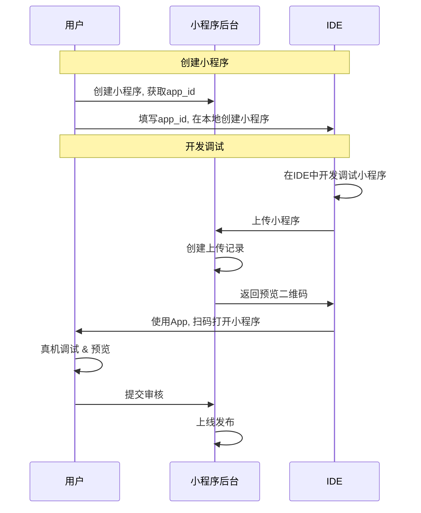
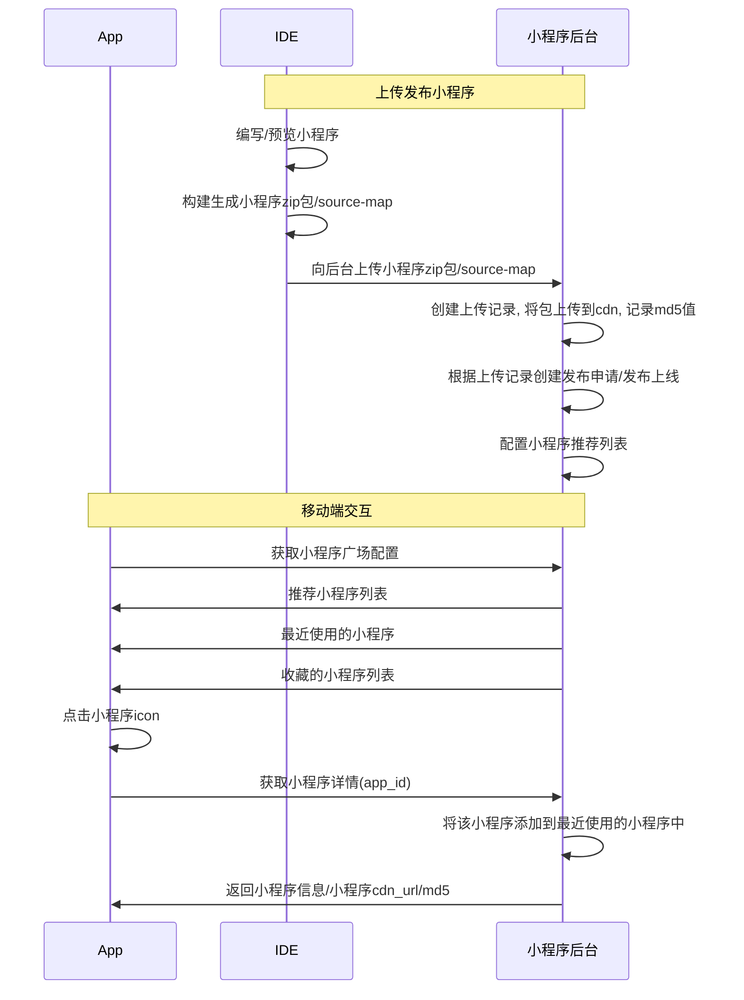

上回说到, 公司决定开发小程序平台, 并委派你作为项目负责人, 编制开发路线图. 所以问题来了, 小程序的开发路线图, 应该是什么样的?

在制定开发路线图前, 我们要先梳理小程序的业务流程, 以及相关的技术点.

# 小程序业务流程

小程序的业务流程可以分为外围和内部两部分. 外围指的是业务方从创建小程序到在 App 上启动的一系列操作, 内部则是小程序在 App 上从启动到退出的全部过程, 这里我们分开讨论.

## 小程序外围流程

小程序外围流程主要分为两部分

首先是注册发布流程



需要实现以下模块&功能

```markdown
- 后台
  - 小程序注册接口
  - 上传接口
  - 提审接口
  - 发布接口
- IDE
  - 创建小程序
    - npx miniprogram-cli create
  - 编辑
  - 打开已有项目
  - 预览小程序
    - npx miniprogram-cli start
  - 小程序打包
    - npx miniprogram-cli build
  - 获取小程序信息
  - 向后台上传小程序
    - 登录后台, 获取上传 token
- miniprogram-cli
  - 整合在 IDE 中
  - 提供 create/start/build 功能
```

其次是启动流程



对应的, 是以下模块&功能

```markdown
- App(Android & iOS)
  - 小程序广场页(一般是聊天列表页下拉)
  - 接口调用(获取小程序具体配置)
  - 静态资源下载 & 校验
  - 启动小程序
- 后台
  - 根据预设条件判断 detail 接口返回值
    - 符合条件返回小程序静态资源地址 & md5 校验值
    - 不符合条件走异常流程
      - 小程序未上线
      - 小程序已下线
      - 小程序已被屏蔽
      - 所在平台未开通小程序
      - 所在城市未开通小程序
      - 所在用户组没有访问小程序权限
      - 基础库版本过低
      - 基础库版本过低, 降级到 h5 地址
      - 基础库版本为特定值, 需要返回指定静态资源内容(锁版本)
```

调研期间我们先不考虑具体实现方案, 只整理完成小程序项目所需的前置技术点, 大致可以分为这么几类

```markdown
# IDE 选型

- [ ] 构建 IDE 可选方案集
  - [ ] VS Code 插件
  - [ ] Electron + 代码编辑器
    - [ ] 代码编辑器方案
      - [ ] [monaco-editor](https://microsoft.github.io/monaco-editor/)
      - [ ] [vscode-web](https://github.com/microsoft/vscode/blob/main/remote/web/package.json)
      - [ ] [code-server](https://github.com/cdr/code-server)(第三方公司实现的 web 版 vscode)
      - [ ] CodeMirror
      - [ ] ace.js
  - [ ] 订制 VS Code
  - [ ] [Theia](https://theia-ide.org/)
  - [ ] [阿里-开天 IDE-未公开发布](https://developer.aliyun.com/article/762768)
- [ ] 编写界面
  - [ ] 创建小程序
  - [ ] 登录小程序后台(以获取上传用的 token)
  - [ ] 启动预览
  - [ ] 启动构建
  - [ ] 上传小程序包
  - [ ] 类 chrome 的 DevTools

# cli 工具

- [ ] 制定/维护小程序项目模板
- [ ] 基于模板创建小程序项目(npx miniprogram create)
- [ ] 启动小程序开发环境(npx miniprogram start)
- [ ] 构建小程序安装包(npx miniprogram start)
- [ ] [进阶]打包输出 source-map, 支持监控线上错误/查看报错详情

# App

- [ ] 小程序启动流程设计
- [ ] 逻辑进程渲染进程间通信方案设计
- [ ] 小程序实现方案设定
  - [ ] 页面切换如何实现
    - [ ] 前进/返回效果
    - [ ] 打开新页面效果
    - [ ] 从 App 进入小程序/从小程序跳转到 App/从小程序跳转到 App 再返回小程序的交互过程 如何实现 / [进阶] 如果跳转到外部 App, 如何实现(微信小程序打开百度地图)
    - [ ] schema 跳转方案
  - [ ] 支付功能
  - [ ] 本地静态缓存
- [ ] Native & js 通信方案实现
  - [ ] js 如何调用 Native 中的接口
  - [ ] Native 如何获取 js 中传入的参数
  - [ ] Native 运行完成后, 如何通知 js. 期间控制流程切换的时序图如何设定
  - [ ] js 如何获取 Native 中执行方法后的结果
- [ ] 实现非 ECMA 语法
  - [ ] 实现 setTimeout

# 小程序后台

- 技术选型
  - 项目方案(Express/koa)
  - ORM 方案
  - CDN 上传
  - redis 库选择
  - 日志记录
  - 接口设计
  - Mock 管理
  - 文档管理
- 用户系统
  - 注册/登录
  - 项目权限管理
    - root 用户
    - 管理员
    - 开发者
    - 预览成员
- 小程序发布流程设计
  - 上传->预览->提审->审核->发布
- 小程序项目配置
  - 项目基础信息(logo/应用名/应用简介/etc)
  - 降级策略
  - 开城策略
  - 注销应用
- [进阶]监控系统
  - 数据清洗
  - 数据存储(ES/mongodb)
  - 错误查询
    - source-map 解析
  - 性能监控
    - 订制数据项
    - 上报/处理/分析数据项

# 小程序基础库(运行在逻辑进程中)

- [ ] API 设计
- [ ] 页面启动
- [ ] 页面切换
- [ ] 页面路由管理
  - [ ] 路由参数读取
- [ ] 触发页面生命周期事件

# 小程序 webview-render(运行在渲染进程中)

- [ ] 订制渲染协议
- [ ] 向逻辑层转发 Dom 事件(支持冒泡)
- [ ] 单实例组件支持(例如地图组件)

# 组件库

- [ ] 技术方案选型
  - [ ] React
  - [ ] Vue
  - [ ] [stencil](https://getstencil.com/)
- [ ] 特殊元素支持
  - [ ] Canvas

# 其他问题

- [ ] 构建小程序预览环境
- [ ] 版本管理与同步
  - [ ] alpha 版本与 正式版
  - [ ] 管理小程序项目/小程序基础库/小程序 webview-render/小程序组件库/Native 小程序 sdk 之间版本对应关系
- [ ] bug 解决
  - [ ] 逻辑进程引擎统一为 V8
    - [ ] jsCore 中 setTimeout 的 bug
      - jSCore 中执行 setTimeout 会直接清空当前微任务队列
      - https://developer.apple.com/forums/thread/678277
```

其中, 最为关键的, 是这两个问题

1.  在逻辑进程/渲染进程中, js 如何与 Native 进行通信 => 如果不能通信, 后续所有交互均无法进行
2.  在逻辑层中运行的 js, 如何在渲染层生成对应 Dom 操作, 以更新界面, 与用户交互 => 这是小程序的核心问题. 如果不能完成逻辑层 js 到渲染层 Dom 的`惊险一跃`, 整个小程序方案将会无从谈起

欲知这两个问题究竟要如何解决, 且听下文分解

# 参考资料

[Taro Next H5 跨框架组件库实践](https://blog.aotu.io/notes/2020/04/13/2020-4-13-taro-components/)(taro 使用 Stencil 的原因)
[Electron 在 Taro IDE 的开发实践](https://blog.aotu.io/notes/2020/04/07/electron-in-taro-ide/)
