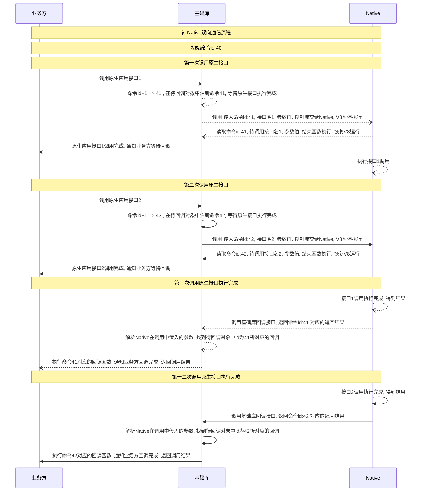
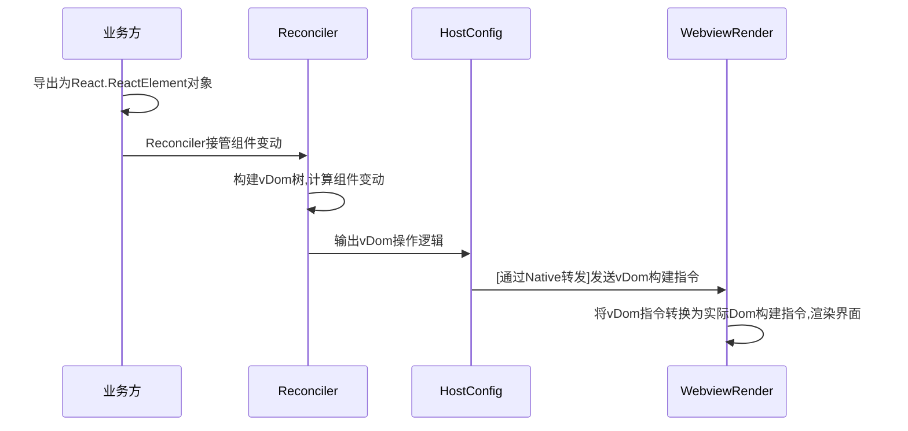
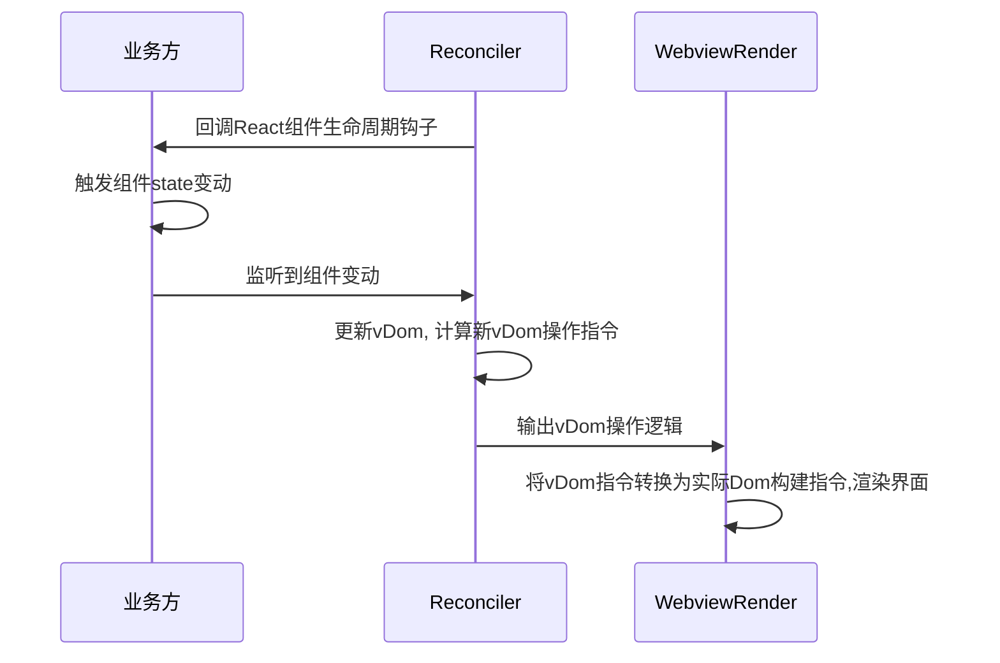
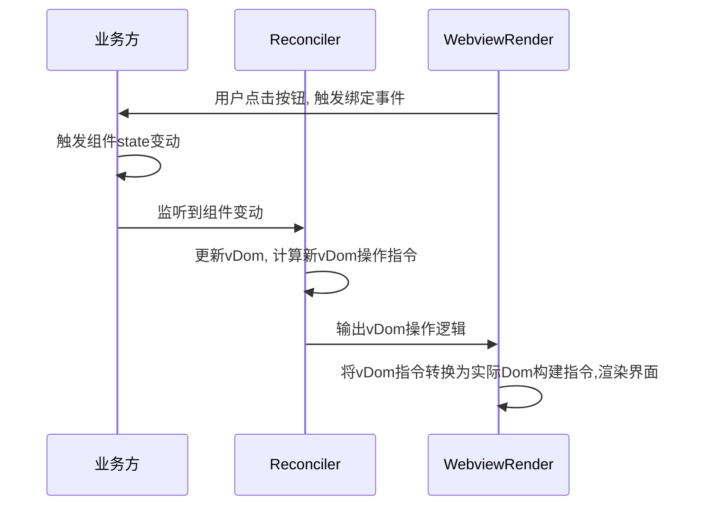

上回说到, 小程序架构中存在两个关键问题, 不解决则小程序项目就无从谈起. 在这篇文章中, 我们会尝试解决这两个问题.

# 在逻辑进程和渲染进程中, js 如何与 Native 通信

如果 js 只在逻辑进程中运行, 不能和外部通信, 那么它既不能使用原生能力, 也不能在渲染进程中构建出实际页面, 小程序架构也就无从谈起. 因此, 小程序基础库首先需要解决的就是 js 如何和 Native/渲染进程通信问题.

## 逻辑引擎中的情况

所谓逻辑引擎, 实际上是 V8/jsCore 的实例. Native 首先实例化 V8 对象, 然后执行小程序 js 文件. 我们需要的是, 如何在执行 js 文件的过程中, 实现和 V8 之间的双向通信.

方法实际上比较简单.

### Native -> JS

由于 V8 是 Native 构建出的一个对象实例, 所以 Native 可以直接在 V8 中执行方法. 此时, JS 方需要做的, 就是启动后注册全局函数`V8CallJs`供 Native 调用. Native 通过参数告知 JS 实际需要传递的信息.

### JS -> Native

JS 调用 Native 相对比较繁琐, 需要 Native 先在 V8 中注册全局函数`JsCallNative`供 js 调用, 在 java 中也要创建类并实现`JavaCallback`接口. 当 js 调用`JsCallNative`时, 会暂停 V8 引擎的运行并将控制权交给 Native. 待函数完成后才会恢复 V8 中 js 的执行. 在实际实现中, 为了避免暂停 V8 引擎导致界面失去响应, 基础库一般会把业务方的原生调用做成回调函数的形式. Native 获知 js 所要调用的函数名和相关参数后立刻返回, 后续通过`V8CallJs`通知具体执行结果, 然后基础库再执行回调函数, 将结果转发给业务方. 这就是为什么微信小程序库中那么多 callback 回调的原因.

> 问: 15 年推出的微信小程序里都是 callback 可以理解, 但为什么后期出现的支付宝小程序/京东小程序里也是 callback, 而不是更加现代的 Promise?
>
> 答: 架构组当然也想优化 API 的设计, 用 Promise 替代难用难维护的 callback. 但问题是微信小程序的 API 是目前业内小程序方案的事实标准, 如果 API 参数&返回值和微信不一致, 接入新开发者/使用小程序转码工具接入新应用都会很困难. 然而应用数量是小程序平台的核心 KPI, 所以只能以微信为准了

`Native 调用 js` 和 `js 调用 Native` 的具体实现可以参考 [JS-V8 通信方案](https://juejin.cn/post/6844904200418131976), 这里重点介绍一下 js 端的实现流程.

## JS 端与 Native 双向通信协议的实现

js 与 Native 双向通信有两个核心要素

1.  跨语言通信中, 无法传递具体函数/原生复杂数据结构.

这一条决定了, 跨语言通信期间, 需要传递的信息最好全部编码为字符串格式, 再具体点说, 是 JSON 字符串. 具体信息通过 json 字段进行传递

> 为了性能当然也可以用二进制方案----只是要做好 debug 难度暴增的准备. 一般来说, 初始阶段快速验证为重, 不建议太追求性能.

2.  在双向通信过程中, 以异步回调为主. 因此通信协议中需要标明这个回调关联的命令 id, 以管理请求/回调之间的关联关系.

所以我们最终的通信协议如下所示

```ts
type Type_Protocol = {
  /**
   * 命令id
   */
  id: number;
  /**
   * 命令类型
   */
  type: "JsCallV8" | "V8CallJs" | "V8CallWebview" | "WebviewCallV8";
  /**
   * 具体调用的API名
   *
   * 可能是Native向JS提供的API : pickerImg/httpRequest/getLocation
   * 也可能是JS向Native提供的API: onProgramHidden/onHomeButtonPress/onProgramHidden
   */
  apiName: string;
  /**
   * json化后的参数列表, 视API具体约定
   */
  argvListJson: string; // Json化后的参数列表
};
```

而通信时序图如下所示



# 渲染进程中的情况

制定完逻辑进程的通信协议, 渲染进程的通信问题就很好处理了. 渲染进程的 webview 也是由 Native 实例化完成, 可以直接复用我们在逻辑进程中设定的通信协议----简单来说, 完全可以把渲染进程中的通信视为 js-bridge 进行处理.

这样, `逻辑进程 <--> Native`双向通信完成, `渲染进程 <--> Native`双向通信完成, 逻辑进程和渲染进程利用 Native 中转也就可以进行通信. 最终通信模型如下

`逻辑进程 <--> Native <--> 渲染进程`

# 逻辑层中运行的 js 如何在渲染层生成对应 Dom 操作

## 第一层思考: 转发 Dom API 操作

逻辑层中运行的是正常 js, 渲染层中展示的是实际 dom 元素, js 不能直接在渲染层中进行操作也不能使用 DOM API 函数----那怎么生成最终的 dom 页面节点?

> 计算机科学领域的任何问题都可以通过增加一个间接的中间层来解决

首先想到的是**封装 DOM API 操作指令**. 虽然不能直接操作 Dom, 但是逻辑层和渲染层可以互相通信. 那完全可以向渲染层发送一系列`Dom API函数名 + 对应参数`, 由运行在渲染层上的 webview-render 实际执行这些函数, 间接实现调用 DOM API 的效果.

这个思路很好, 我们也可以在逻辑层中自行构建一个 document 对象, 对业务方暴露`document.createElement`方法, 在业务方调用该方法的时候把参数原样发送到渲染层完成问题.

方案好是好, 但实际操作中有点麻烦, 能不能简单一点?

## 第二层思考: 利用类 React/vue 语法构建虚拟 dom, 屏蔽 Dom API 操作

当然可以, 我们可以自定义一套模板语法, 根据模板语法创建实际 dom, 让用户可以不去写`document.createElement`.

在模板语法方面, 最简单的方案是`html + innerHtml`, 进阶是编写模板生成虚拟 dom + 利用 snabbdom 生成 dom 更新指令, 也就是微信小程序目前使用的方案. 但, 订制模板语法 + 构建虚拟 dom 开发成本还是很高, 还能更简单点吗?

当然可以

## 第三层思考: 直接使用 React 作为小程序界面展示方案

React16 相对 15 的一个重大变化, 就是将架构模型升级到了 Fiber. 在 Fiber 架构下, React 执行过程如下所示.

`React component API <----> Reconciler 调和器 ----> Renderer 渲染器`

`React component API`对应于业务层代码, 是我们熟悉的 setState/useState 状态控制函数和 compontentDidUpdate/shouldComponentUpdate 生命周期方法.

组件中的状态控制函数(setState/useState)由`Reconciler 调和器`实现. 这样当组件创建完成/状态发生改变时, 就可以被`Reconciler 调和器`发现, 进而比较虚拟 dom 变动生成更新指令. 然后用实现了[HostConfig](https://github.com/facebook/react/blob/main/packages/react-reconciler/src/forks/ReactFiberHostConfig.custom.js)接口的对象作为中间层, 将虚拟 dom 指令转发给`Renderer 渲染器`, 并由`Renderer 渲染器`根据虚拟 Dom 指令在对应平台上转换为实际效果.

在 React16 的渲染流程里, 有三个关键点

1.  前端界面使用 React 直接编写, 编写过程和`生成虚拟Dom`/`最终页面展示`无关
2.  `Reconciler 调和器`输出的虚拟 dom 操作指令通过实现了 HostConfig 接口的对象进行转发, 该对象只要求实现约定接口, **对提供者和接口具体实现没有要求**
3.  `Renderer 渲染器`只需要保证将传来的操作指令转译为平台上对应的操作, 对**操作方式的具体实现没有要求**, 对**平台也没有要求**

那么, 我们是否可以在逻辑进程里实现一个 HostConfig 对象, 在渲染进程上实现一个 webview-render. 然后通过 Native 把 HostConfig 收到的操作指令转发给 webview-render, 从而完成页面的构建呢?

当然可以!

实现方案如下

`业务方React代码 <--> React component API <----> Reconciler 调和器 --> HostConfig对象(逻辑进程) --> Native转发操作命令&操作 ----> webview-render((渲染进程))`

### 初次构建



### Reconciler 触发生命周期回调



### 渲染层触发用户触发交互



基本方案给出, 现在只有两个问题:

1.  [原理层面] React 项目是如何启动的? 为什么`Reconciler 调和器`在哪里替换的 setState 实现?
2.  [实现层面] 小程序本身启动过程是什么样的. 我们的 HostConfig 和 webview-render 具体需要如何实现?

欲知后事如何, 且听下回分解
